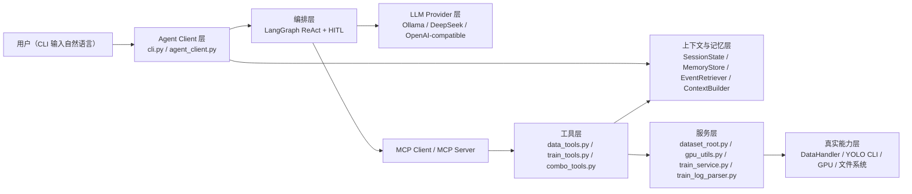
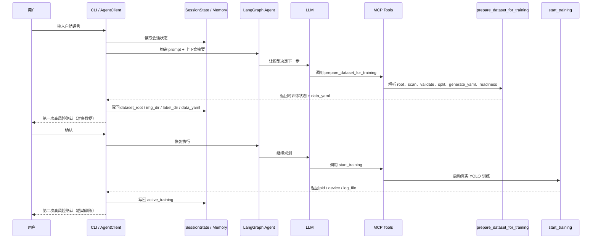

# YoloStudio Agent 架构学习手册（面向初学者）

> 目的：这不是“项目总结”，而是一份**带知识解释的学习文档**。  
> 它试图回答 4 个问题：
>
> 1. 这个 Agent 项目现在到底长什么样？
> 2. 每一层技术是拿来解决什么问题的？
> 3. 这些设计是怎么一步步演化出来的？
> 4. 我如果想借这个项目学习 Agent 开发，应该从哪里看起？

---

## 1. 先用一句话理解这个项目

这个项目不是“让大模型直接替你训练 YOLO”。

它更准确的定义是：

> **用一个会调用工具的 Agent，把“数据准备 → 训练管理”这条 YOLO 工作流包装成自然语言可操作的系统。**

用户看到的是一句话：

- “扫描这个数据集”
- “先按默认比例划分，然后训练”
- “现在有没有训练在跑”

系统内部做的是：

- 理解意图
- 选择工具
- 执行真实代码
- 记录状态
- 对高风险步骤做人审确认（HITL）

---

## 2. 当前架构总览

### 2.1 总体分层图



这张图最重要的意思是：

- **模型不直接碰训练代码**
- **模型先走工具层**
- **工具层再去调用真实服务**
- **执行结果会回写到记忆层**

这是 Agent 工程里一个很典型的思路：  
**把“会说话的大脑”和“真的干活的手脚”分开。**

---

### 2.2 一次典型请求是怎么流转的

例如用户输入：

> “数据在某个目录里，先按默认比例划分，然后用 yolov8n 训练”

系统内部大致是这样走的：



要点：

1. **LLM 不直接训练**，只是做规划和工具选择。
2. **高风险动作被拦截**，不会模型一想到就直接执行。
3. **状态会被写回**，这样下轮对话还能接上。

---

## 3. 当前目录结构：每一层到底放什么

> 以下路径全部是相对项目根目录的相对路径，便于理解结构。

### 3.1 Agent 客户端

```text
agent/client/
├── cli.py
├── agent_client.py
├── llm_factory.py
├── session_state.py
├── memory_store.py
├── context_builder.py
├── event_retriever.py
├── tool_adapter.py
└── tool_result_parser.py
```

#### 这一层解决什么问题？

它解决的是：

- 用户如何输入自然语言
- 模型怎么接入
- 上下文怎么保存
- HITL 怎么做
- 工具结果怎么回写状态

#### 为什么不把这些逻辑都写在一个文件里？

因为 Agent 最容易失控的地方不是“能不能调模型”，而是：

- 状态乱
- 工具乱
- 历史对话越来越长
- 不同 provider 接入方式不同

所以这里做了拆分。

---

### 3.2 MCP Server 与工具层

```text
agent/server/
├── mcp_server.py
├── tools/
│   ├── data_tools.py
│   ├── train_tools.py
│   └── combo_tools.py
└── services/
    ├── dataset_root.py
    ├── gpu_utils.py
    ├── train_service.py
    └── train_log_parser.py
```

#### 这一层解决什么问题？

它解决的是：

- 哪些能力对 Agent 可调用
- 工具接口长什么样
- 训练如何启动 / 停止 / 查询
- GPU 怎么选
- 数据集目录怎么识别

#### 为什么要分成 tools 和 services？

这是个很重要的工程点：

- `tools/`：**给 LLM 调用的外部接口**
- `services/`：**真正执行业务逻辑的内部实现**

也就是说：

> tool 像“前台窗口”，service 像“后台车间”。

这样做的好处是：

- LLM 看到的是稳定接口
- 真正复杂逻辑藏在 service 层
- 后面换模型、换 tool schema，都不用推翻核心逻辑

---

### 3.3 测试层

```text
agent/tests/
```

这里不是只放单元测试，而是放了三类测试：

1. **冒烟测试**
   - 能不能跑起来
2. **能力范围测试**
   - 能不能处理复杂提示词
3. **真实数据集压力测试**
   - 用真实脏数据、大数据、真实训练去测边界

这非常重要，因为 Agent 项目最怕：

> “函数都没报错，但真实场景一用就翻车。”

---

## 4. 核心技术清单：每项技术到底是干嘛的

下面这张表，是这份文档最重要的部分之一。

| 技术/模块 | 它是什么 | 它解决什么问题 | 如果没有它会怎样 |
|---|---|---|---|
| MCP | 模型上下文协议 | 把能力暴露成标准工具接口 | Agent 会和具体代码强耦合 |
| FastMCP | MCP Server 实现 | 快速把 Python 函数暴露成工具 | 需要手写一堆 server 协议代码 |
| LangGraph | Agent 编排框架 | 管多轮、工具、HITL、中断恢复 | 流程会散在一堆 if/else 里 |
| ReAct Agent | 一种“思考→行动→观察”模式 | 让模型先判断再调用工具 | 模型只会闲聊，不会做事 |
| HITL | Human-in-the-Loop | 高风险动作必须人工确认 | 模型可能直接改数据或开训练 |
| SessionState | 会话状态对象 | 记住当前数据集、当前训练、待确认操作 | 每轮都像失忆 |
| MemoryStore | 状态持久化 | 把状态和事件落盘 | client 重启就丢上下文 |
| EventRetriever | 历史事件摘要 | 长对话后还能回忆关键事实 | 历史越长越乱 |
| ContextBuilder | prompt 组装器 | 把“状态 + 摘要 + 最近消息”喂给模型 | 只能靠原始聊天历史硬扛 |
| LLM Provider 抽象 | 统一接入 Ollama / DeepSeek | 模型可替换 | 代码会绑死某一个模型 |
| tool_adapter | 工具输出适配层 | 兼容不同模型对 tool message 的格式要求 | DeepSeek/OpenAI 兼容模型会报格式错 |
| dataset_root resolver | 数据集根目录解析器 | 把 dataset root 自动解析成 images/labels | 用户说 root 路径时很容易扫错 |
| prepare_dataset_for_training | 高层组合工具 | 把“准备数据”压缩成稳定流程 | 模型要自己规划太多步 |
| gpu_utils | GPU 状态/策略层 | 按真实占用选择单卡/多卡/手动 | device 逻辑会写死、易过时 |
| train_service | 训练服务层 | 用 subprocess 启动训练、查状态、停训练 | 训练逻辑会散在 tool 层，难维护 |
| run registry | 训练任务注册表 | MCP 重启后还能接管训练 | 重启后训练在跑，但系统“失联” |
| train_log_parser | 日志解析器 | 从 YOLO 输出里提取状态/指标 | 只能看到日志文件，看不到状态摘要 |
| SSH Tunnel | 安全连接方案 | 不直接暴露远端 MCP / LLM 服务 | 内网安全边界更弱 |

---

## 5. 为什么这些技术会被引入：知识点解释

### 5.1 为什么要引入 MCP，而不是直接 import 函数？

#### 初学者版理解

如果 Agent 直接 `import xxx` 然后随便调：

- 模型和代码耦合非常死
- 很难远程部署
- 很难给别的 Agent/客户端复用

MCP 的价值是：

> **把“模型能用的能力”标准化成工具接口。**

你可以把它理解成：

- Python 函数是“裸能力”
- MCP tool 是“标准插座”

这样以后：

- 可以换模型
- 可以换客户端
- 可以换运行位置
- 工具层不用推倒重来

---

### 5.2 为什么要用 LangGraph，而不是自己手写一个 while 循环？

因为 Agent 和普通脚本不一样。

它需要处理：

- 多轮对话
- 工具调用
- 中途暂停
- 人工确认
- 失败恢复

手写 `while True` 也不是不行，但很快会变成：

- 状态难维护
- 恢复点难找
- 多 provider 行为难控

LangGraph 的价值是：

> **把“Agent 的流程状态机”这件事变成正式能力。**

---

### 5.3 为什么要有 SessionState，而不是只保留聊天记录？

这是 Agent 新手最容易误解的点之一。

很多人以为：

> “只要把前面聊天记录都丢给模型，它就能记住。”

现实里这通常不够好，因为：

1. 聊天记录会越来越长
2. 工具结果很长，模型未必能准确回忆
3. “当前数据集是谁”其实是结构化信息，不是适合靠自然语言记忆的信息

所以我们把记忆拆成两类：

#### 非结构化记忆
- 最近几轮聊天

#### 结构化记忆
- 当前 dataset_root
- 当前 img_dir / label_dir
- 当前 data_yaml
- 当前 active_training
- 当前 pending_confirmation

这个设计思路本身就是一个重要知识点：

> **Agent 不应该只靠原始聊天历史记忆关键状态。**

---

### 5.4 为什么引入 EventRetriever，而不是只存 state？

因为 `SessionState` 更像“当前快照”，而不是“历史过程”。

例如：

- 当前数据集是谁
- 当前训练是否在跑

这是 state。

但这些问题：

- “刚才为什么没训练？”
- “最近一次 prepare 做了什么？”
- “上一次 validation 发现了什么问题？”

其实更像**历史事件**。

所以需要：

- `MemoryStore` 记录事件
- `EventRetriever` 把历史事件压缩成摘要

这个设计对应的知识点是：

> **Agent 的记忆通常至少要分成：当前状态 + 历史事件。**

---

### 5.5 为什么要做 LLM Provider 抽象？

因为真正可用的 Agent 不能绑死在一个模型上。

如果系统写成：

- 全部默认 `ChatOllama(gemma4:e4b)`

那后面一旦切：

- DeepSeek
- 其他 OpenAI-compatible API
- vLLM / 本地别的 serving

就会很痛。

所以引入 `llm_factory.py` 的核心思想是：

> **让系统依赖“统一的模型接口”，而不是依赖某一个模型品牌。**

这个思想在工程里非常常见：

- 面向接口编程
- 抽象层隔离变化

---

### 5.6 为什么 GPU 不能写死成“0 给 LLM，1 给训练”？

这也是一个很重要的工程教训。

一开始很容易这么想：

- GPU0 跑 Ollama
- GPU1 跑训练

但现实会变：

- 有时改成 API provider，根本不占本地 GPU
- 有时换 vLLM，多卡 serving
- 有时用户把推理进程放到别的卡

所以正确做法不是按“模型框架”写死规则，而是：

> **按 GPU 当前真实占用状态，再结合策略决定设备。**

这就是 `gpu_utils.py` 的核心知识点：

- 先查 `nvidia-smi`
- 看哪些卡 busy
- 再按策略决定：
  - `single_idle_gpu`
  - `all_idle_gpus`
  - `manual_only`

---

### 5.7 为什么需要 run registry？

这个问题是主线后期才补上的，很有代表性。

一开始 `TrainService` 只在内存里有：

- `_process`
- `_pid`

这会导致一个严重问题：

> MCP 重启后，训练可能还在跑，但 Agent 已经不知道它是谁了。

所以后面引入了 run registry：

- `active_train_job.json`
- `last_train_job.json`

这个设计对应的知识点是：

> **只要任务可能跨进程/跨重启存在，就不能只用内存态管理它。**

---

## 6. 这个项目是怎么一步步演化出来的（按提交分阶段理解）

下面不是把每个 commit 都逐字解释，而是把关键阶段串起来。

### Phase 1：骨架打通

代表提交：

- `86e8e8c` `init: Phase 1 完成 + Phase 2 骨架代码`
- `297f71e` `Phase 1+2 验收完成: GPU隔离/MCP启动/Tool验证/SSH免密`

这一阶段解决的问题：

- 最小 MCP server 能不能启动
- 本地 CLI 能不能连远端
- Gemma 工具调用能不能冒烟成功

知识点：

- 原型阶段先打通主链路，不要先求完美

---

### Phase 2：工具层从“能调”变成“能用”

代表提交：

- `8ce4cda` 统一错误处理、前置校验、smoke test
- `1925381` 改善训练和数据工具输出
- `2ded8bc` 加入 `generate_yaml` 和 `training_readiness`

这一阶段解决的问题：

- 工具不只是 callable，还要：
  - 输出结构稳定
  - 错误好理解
  - 能给 Agent 下一个动作提示

知识点：

> Agent 工程里，tool 的“语义质量”往往比“数量”更重要。

---

### Phase 3：上下文系统成型

代表提交：

- `3de7d06` `feat: add structured context memory and event retrieval`

这一阶段解决的问题：

- 不能只靠聊天记录记东西
- 会话需要结构化状态
- 工具结果要写回记忆

知识点：

> Agent 的记忆不是“聊天记录越多越好”，而是“状态和历史要分层”。 

---

### Phase 4：模型抽象与 GPU 策略升级

代表提交：

- `76bc3f7` `feat: add provider abstraction and adaptive gpu allocation`

这一阶段解决的问题：

- 不再绑死 `Ollama + Gemma`
- GPU 设备策略不再写死

知识点：

- Provider abstraction
- Runtime policy
- 真实资源状态优先于拍脑袋配置

---

### Phase 5：数据准备主线增强

代表提交：

- `7acae6c` `feat: resolve dataset root paths and add preparation flow`
- `6ed5214` `feat: harden dataset preparation and session state handling`
- `1aee7be` `feat: tighten training intent consistency across providers`

这一阶段解决的问题：

- 用户说的是 dataset root，不是 `img_dir`
- 复杂意图不能太依赖模型自己拆步骤
- 两个 provider 对复杂训练主线要尽量走一致路径

知识点：

> 当模型规划能力不够稳定时，正确做法不是只换模型，而是抬高工具抽象层次。

---

### Phase 6：系统稳定性补丁

代表提交：

- `a2e7a65` `feat: persist training runs across MCP restarts`

这一阶段解决的问题：

- 训练运行中 MCP 重启
- fresh 进程重新接管训练状态
- stop/query 不再依赖进程内句柄

知识点：

> 真正接近投入使用时，系统问题往往不再是“会不会调用工具”，而是“重启、恢复、状态一致性”。 

---

## 7. 我们遇到过哪些困难，是怎么解决的

下面这张表是“问题 → 根因 → 解决方案”的映射。

| 问题 | 根因 | 解决方式 |
|---|---|---|
| 复杂提示词下 Gemma 空白输出 | 模型自己规划步骤过多，dataset root 语义又不清 | 加 `dataset_root resolver` 和 `prepare_dataset_for_training` |
| DeepSeek/OpenAI 兼容模型调用 tool 报消息格式错 | tool message content 结构不兼容 | 加 `tool_adapter.py`，把工具输出适配成字符串 |
| 长对话越来越乱 | 只靠原始消息列表记忆 | 引入 `SessionState + MemoryStore + EventRetriever + ContextBuilder` |
| fresh session 会被旧训练污染 | 状态回写逻辑过宽 | 收紧 `check_training_status` 的状态写回规则 |
| MCP 重启后训练失联 | 训练状态只保存在内存进程句柄里 | 引入 run registry 持久化 pid/log/args |
| 数据集根目录被误当成 `img_dir` | tool 语义和用户语言不匹配 | 先做 root 解析，再让 scan/readiness/prepare 统一支持 root |
| GPU 规则一开始写得太死 | 把部署方式误当成设备策略 | 改成按 `nvidia-smi` 真实占用 + policy 决策 |
| 脏数据下解释层会说过头 | Gemma 自然语言解释强于事实约束 | 收紧 prompt、用工具返回字段约束表达 |
| 工具很多但复杂任务还是不稳 | 只有低层工具，没有高层组合能力 | 加 combo tool，降低对模型规划能力的依赖 |

---

## 8. 当前项目已经能做到什么

### 8.1 当前比较稳的能力

- 标准 YOLO 目录结构的 root 识别
- 数据集扫描、校验、划分、增强、YAML 生成
- 训练前 readiness 判断
- 训练启动 / 状态查询 / 停止
- 高风险动作人工确认
- 双 provider（Ollama / DeepSeek）主链路运行
- MCP 重启后训练接管
- 较长上下文下的主线对话

### 8.2 当前仍存在的边界

- 非标准数据集结构虽然比以前好，但还没做到完全智能容错
- 脏数据风险表达还不够强，例如“大量缺失标签”未必被提升成强 blocker
- 生成 YAML 时，类名语义保留还不够稳
- Gemma 的“执行链路”比“解释层”更可靠
- durable checkpoint / production-grade persistence 还没完全做完

---

## 9. 当前项目离“正式投入使用”还差什么

如果按学习视角，可以把差距理解成 3 层：

### 9.1 原型已经具备

- 主链路闭环
- 高风险确认
- provider 可替换
- 真实训练验证

### 9.2 还差的“准生产能力”

- durable checkpoint
- 更完整的 tracing / observability
- 更系统的 eval / regression 框架
- 更成熟的任务生命周期治理

### 9.3 还差的“共享系统能力”

- 鉴权
- 多用户并发
- 资源调度
- 审计
- 隔离

这也说明：

> 当前项目已经很适合学习 Agent 工程，但还不是一个“可直接多人共享上线”的成品。

---

## 10. 如果你想借这个项目学习 Agent，建议怎么读

### 第一步：先看入口

按这个顺序读最容易：

1. `agent/client/cli.py`
2. `agent/client/agent_client.py`
3. `agent/server/mcp_server.py`

你会先理解：

- 用户怎么进来
- 模型怎么接入
- 工具怎么被注册

---

### 第二步：再看“为什么它能记住事”

继续读：

4. `agent/client/session_state.py`
5. `agent/client/memory_store.py`
6. `agent/client/context_builder.py`
7. `agent/client/event_retriever.py`

你会理解：

- Agent 不是只靠聊天记录工作
- 结构化记忆是怎么设计的

---

### 第三步：再看“为什么它能干活”

继续读：

8. `agent/server/tools/data_tools.py`
9. `agent/server/tools/combo_tools.py`
10. `agent/server/tools/train_tools.py`

你会理解：

- 工具如何被设计成适合 LLM 使用
- 为什么高层组合工具很重要

---

### 第四步：最后看“为什么它没那么脆”

继续读：

11. `agent/server/services/dataset_root.py`
12. `agent/server/services/gpu_utils.py`
13. `agent/server/services/train_service.py`
14. `agent/server/services/train_log_parser.py`

你会理解：

- 资源策略
- 训练状态治理
- 目录解析
- 重启恢复

---

## 11. 适合初学者记住的 10 个核心认知

1. **Agent 不等于聊天机器人。**  
   真正的 Agent 要能调工具、管状态、处理流程。

2. **模型聪明很重要，但系统设计更重要。**  
   tool 抽象差，再强的模型也会翻车。

3. **记忆不能只靠聊天记录。**  
   关键业务状态要结构化保存。

4. **Tool 数量不是重点，Tool 语义才是重点。**

5. **复杂任务要尽量做成高层组合工具。**

6. **高风险动作必须做人审确认。**

7. **资源策略要看真实运行状态，不要写死。**

8. **只要任务可能跨重启存在，就不能只用内存保存状态。**

9. **真实数据和真实训练比“写几个单元测试”更能暴露 Agent 问题。**

10. **Agent 工程最终比拼的是“稳定可复用”，不是“偶尔演示成功”。**

---

## 12. 延伸阅读（官方资料）

> 下面这些资料不是当前系统必须联网才能工作，而是你想继续学习时很值得看。

- LangGraph Persistence  
  <https://docs.langchain.com/oss/python/langgraph/persistence>
- LangGraph Interrupts  
  <https://docs.langchain.com/oss/python/langgraph/interrupts>
- MCP Transports  
  <https://modelcontextprotocol.io/specification/draft/basic/transports>
- MCP Authorization  
  <https://modelcontextprotocol.io/specification/draft/basic/authorization>
- DeepSeek Function Calling  
  <https://api-docs.deepseek.com/guides/function_calling>
- NVIDIA NVML / nvidia-smi 相关文档  
  <https://docs.nvidia.com/deploy/nvidia-smi/index.html>

---

## 13. 最后一段总结

如果你把这个项目当成一个“Agent 学习样板”，它最有价值的地方不是某一个函数写得多漂亮，而是它完整地展示了：

```text
自然语言
  -> 模型规划
  -> 工具调用
  -> 服务执行
  -> 状态回写
  -> 风险确认
  -> 重启恢复
  -> 真实训练闭环
```

这条链一旦真的跑通，你对 Agent 的理解就会从：

- “大模型会不会回答”

变成：

- “一个 Agent 系统如何把模型、工具、状态、执行和风险控制拼成可工作的软件”

这正是这个项目目前最适合作为跳板去学习的地方。
