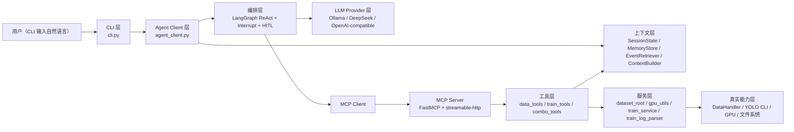
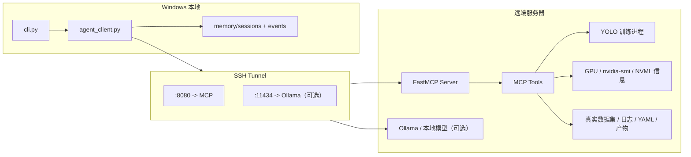
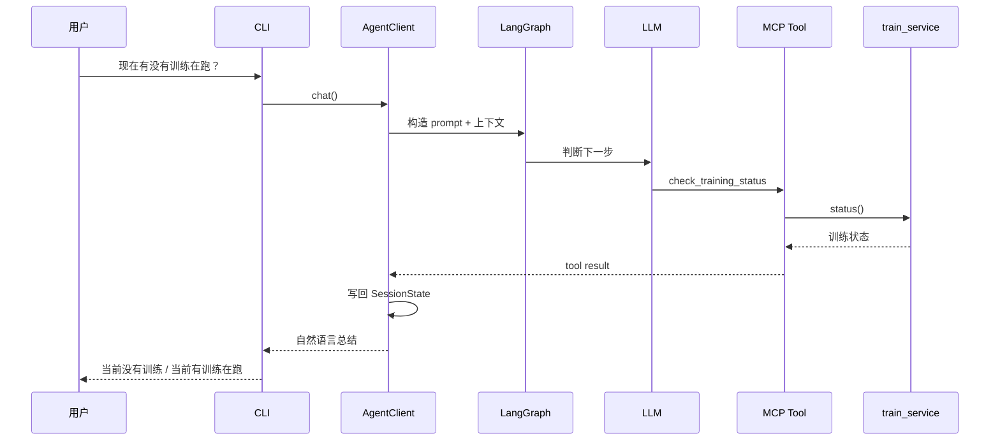
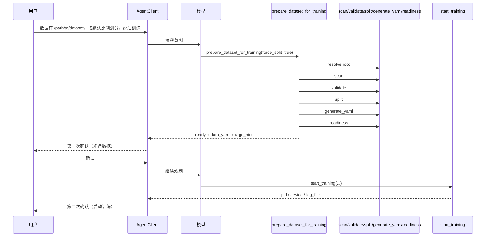
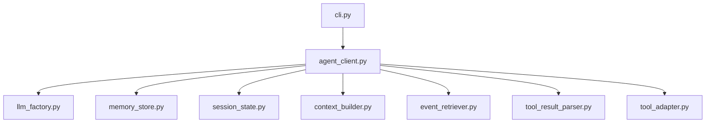
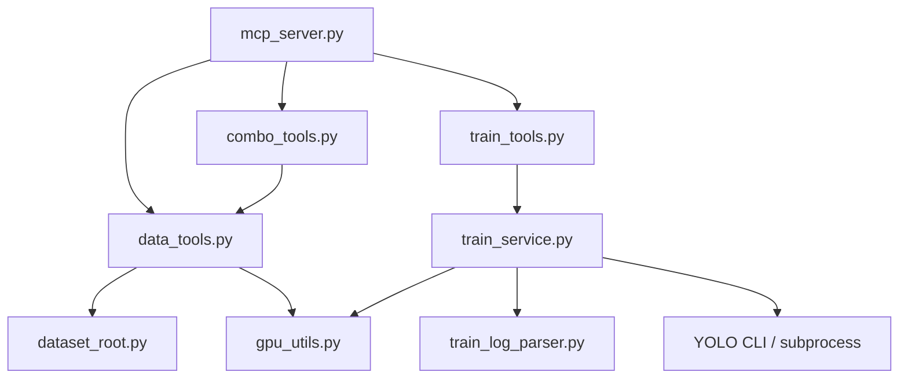
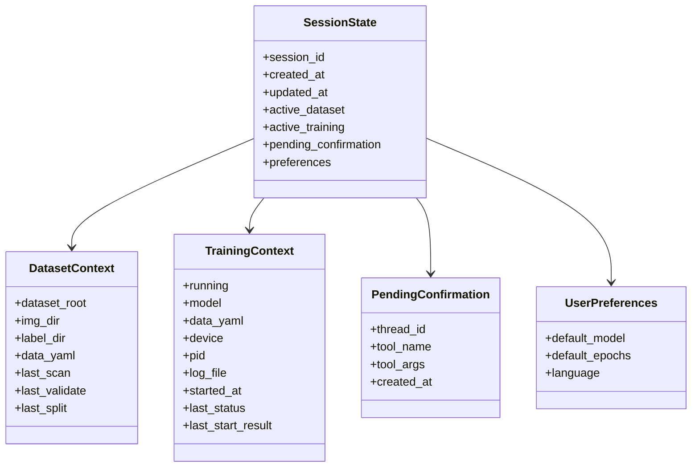
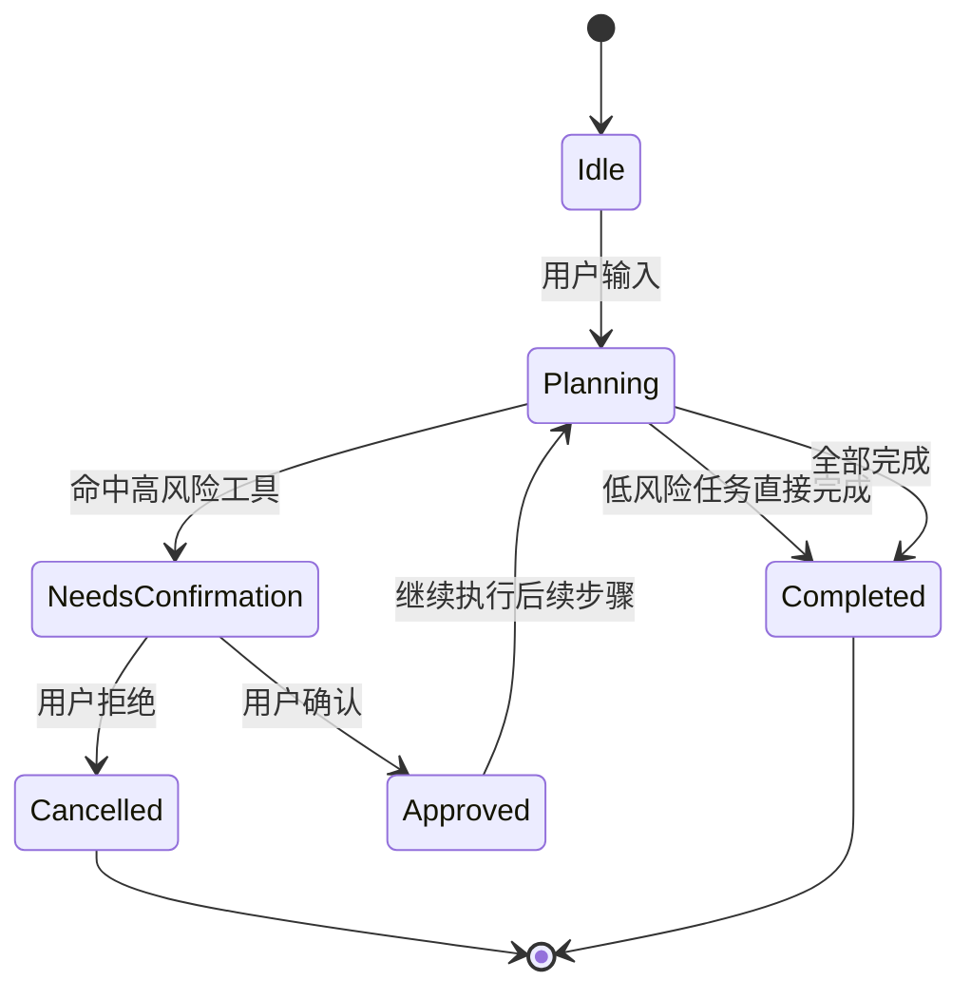
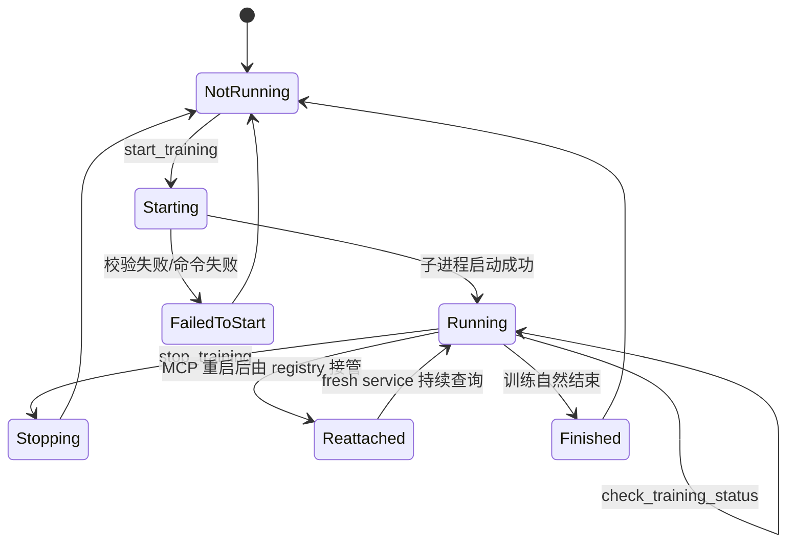

# YoloStudio Agent 架构学习手册（面向初学者，扩展版）

> 文件定位：这是 `D:\yolodo2.0\agent_plan` 里的**学习型文档**，不是单纯项目总结。  
> 目标：把这个项目当成一个 Agent 工程样本，用它来解释“Agent 系统为什么这样设计、解决了什么问题、还差什么”。

---

## 0. 你应该怎么使用这份文档

这份文档不是给“只想知道当前能不能用”的人看的。它是给下面这类读者准备的：

- 想学 Agent 开发，但不想停留在概念层
- 想知道一个真实项目为什么要引入 MCP、LangGraph、Memory、HITL
- 想从“项目演进历史”反推技术决策
- 想知道一个工程化 Agent 和“普通聊天机器人”到底差在哪

推荐阅读顺序：

1. 先看 **第 1 章到第 3 章**，建立全局印象
2. 再看 **第 4 章到第 8 章**，理解每层技术是干什么的
3. 再看 **第 9 章到第 12 章**，理解项目是怎么演化出来的
4. 最后看 **第 13 章到第 16 章**，把它变成你的学习地图

---

## 1. 用一句话理解这个项目

这个项目不是“让大模型直接替你训练 YOLO”。

它更准确的定义是：

> **用一个会调用工具的 Agent，把“数据准备 → 训练管理”这条 YOLO 工作流包装成自然语言可操作的系统。**

用户看到的是一句话：

- “扫描这个数据集”
- “先按默认比例划分，然后训练”
- “现在有没有训练在跑”
- “如果有训练在跑就停掉，没有就只告诉我状态”

系统内部做的却是很多层动作：

- 理解意图
- 选择工具
- 调真实代码
- 记录上下文
- 在高风险点暂停
- 让人确认后继续
- 在服务重启后尝试接管训练状态

这就是为什么这个项目适合拿来学 Agent：

> 它不是“会聊天的模型”，而是“由模型驱动、但受系统约束的执行系统”。

---

## 2. 先建立 3 个最重要的认知

### 2.1 认知一：Agent != 聊天机器人

很多初学者一说 Agent，脑中想到的是：

- 一个更聪明的聊天框
- 一个能回答更多问题的模型

但在工程里，Agent 更像：

> **一个用自然语言作为入口、用模型做规划、用工具做执行、用状态系统做记忆的软件系统。**

也就是说：

- 聊天机器人重点在“回答”
- Agent 重点在“完成任务”

这两者的核心差别不是“模型多强”，而是：

- 有没有工具层
- 有没有状态层
- 有没有流程控制
- 有没有风险控制

---

### 2.2 认知二：模型是“大脑”，不是“手脚”

在这个项目里，模型的作用主要是：

- 理解用户说的话
- 判断应该调用哪个工具
- 决定工具调用顺序
- 在工具返回后进行总结

真正干活的是：

- 数据扫描逻辑
- 数据集划分逻辑
- YAML 生成逻辑
- GPU 检测逻辑
- 训练启动 / 查询 / 停止逻辑

也就是说：

> **LLM 负责想，tools/service 负责做。**

这是一个非常关键的 Agent 工程原则。

---

### 2.3 认知三：Agent 成败不只看模型，更看系统设计

现实里，很多 Agent 做不稳，不是因为模型不够聪明，而是因为：

- tool 设计太底层
- 数据语义和用户语言不一致
- 上下文没有结构化
- 高风险动作没有 HITL
- 运行状态只放在内存里

所以真正的 Agent 工程，实际上是在解决：

```text
模型规划能力
× 工具抽象质量
× 记忆结构设计
× 运行时流程控制
× 恢复/观测能力
```

这个项目一路演进下来，最值得学习的，恰恰就是这一整套平衡过程。

---

## 3. 当前系统长什么样：整体架构

### 3.1 总体分层图



### 3.2 为什么要这么分层？

因为如果不分层，最后很容易变成这种混乱结构：

```text
聊天输入 -> 模型 -> if/else -> 直接调代码 -> 直接开训练 -> 结果乱塞回对话
```

这种结构的问题是：

- 很难换模型
- 很难远程部署
- 很难定位问题
- 很难加 HITL
- 很难做状态恢复

所以我们把系统拆成层，每层只负责一件事：

| 层 | 负责什么 |
|---|---|
| CLI 层 | 用户入口 |
| Agent Client 层 | 管理一次对话与一次任务流 |
| 上下文层 | 记住当前状态与历史事件 |
| 编排层 | 管理“模型 → 工具 → 继续/暂停”的流程 |
| LLM Provider 层 | 统一接入不同模型 |
| MCP 层 | 把能力标准化成工具调用 |
| 工具层 | 对外暴露稳定接口 |
| 服务层 | 执行真正业务逻辑 |
| 真实能力层 | 数据处理、训练、文件系统、GPU |

这就是“工程化 Agent”和“脚本拼接”的本质区别。

---

## 4. 部署视角：它是怎么跑起来的

### 4.1 部署拓扑图



### 4.2 这张图说明了什么？

它说明系统有两个关键分离：

#### 分离 1：Agent Client 和真实执行环境分离

- Windows 上跑的是交互层
- 服务器上跑的是执行层

好处：

- 你本地不用背训练环境
- 服务器负责真正 GPU 与数据
- 本地只负责对话和状态组织

#### 分离 2：模型来源和训练资源分离

这个项目现在已经支持：

- 本地/服务器上的 Ollama 模型
- DeepSeek 这类 API provider
- OpenAI-compatible provider

这意味着：

> **训练用什么 GPU，不应该再由“模型部署方式”硬编码决定。**

所以后面才会演化出动态 GPU 策略。

---

## 5. 典型请求：一次用户输入，系统内部怎么走

### 5.1 简单请求：查询当前训练状态



这是最标准的 ReAct 模式：

1. 模型先判断需不需要工具
2. 工具返回真实结果
3. 模型再基于真实结果回答

---

### 5.2 复杂请求：数据根目录 → 准备 → 训练



### 5.3 这条链为什么重要？

因为它正好是这个项目最典型、也最容易暴露问题的主线：

- 用户说的是 dataset root
- 工具实际需要的是 img_dir / label_dir / data_yaml
- 模型需要规划多个步骤
- 中间既有“会改数据”的动作，又有“会开长任务”的动作

所以这个项目很多关键设计，都是围绕这条链不断补出来的。

---

## 6. 代码结构总表：每个文件到底在做什么

### 6.1 客户端层

| 文件 | 作用 | 为什么要有它 |
|---|---|---|
| `agent/client/cli.py` | 命令行入口 | 让用户能直接在本地交互 |
| `agent/client/agent_client.py` | Agent 主协调器 | 串起 LLM、Graph、Memory、HITL、Tool 结果回写 |
| `agent/client/llm_factory.py` | 模型工厂 | 解耦 Ollama / DeepSeek / OpenAI-compatible |
| `agent/client/session_state.py` | 结构化会话状态 | 保存当前 dataset、training、pending confirmation |
| `agent/client/memory_store.py` | 状态和事件落盘 | 让状态不只存在内存中 |
| `agent/client/context_builder.py` | prompt 组装器 | 控制喂给模型的上下文结构 |
| `agent/client/event_retriever.py` | 历史摘要与事件检索 | 防止长对话只靠原始历史 |
| `agent/client/tool_adapter.py` | Tool 消息格式适配 | 兼容 DeepSeek/OpenAI-compatible 的消息格式要求 |
| `agent/client/tool_result_parser.py` | 统一解析 tool result | 把工具返回转成结构化 dict |

---

### 6.2 服务端层

| 文件 | 作用 | 为什么要有它 |
|---|---|---|
| `agent/server/mcp_server.py` | MCP 注册入口 | 把 tools 暴露成 MCP 能调用的接口 |
| `agent/server/tools/data_tools.py` | 数据工具接口 | 把数据处理能力包装成 LLM 可调工具 |
| `agent/server/tools/train_tools.py` | 训练工具接口 | 把训练能力包装成 LLM 可调工具 |
| `agent/server/tools/combo_tools.py` | 高层组合工具 | 降低复杂任务对模型规划能力的依赖 |
| `agent/server/services/dataset_root.py` | 数据集根目录解析 | 解决“用户说 root，但代码要 img_dir/label_dir” |
| `agent/server/services/gpu_utils.py` | GPU 状态与策略 | 按真实占用决定 auto 设备行为 |
| `agent/server/services/train_service.py` | 训练生命周期管理 | 启动、查询、停止、重启接管训练 |
| `agent/server/services/train_log_parser.py` | 日志解析 | 把 YOLO 训练日志转成机器可理解状态 |

---

### 6.3 测试层

测试文件很多，但可以按意图归类：

| 类型 | 例子 | 目的 |
|---|---|---|
| 冒烟测试 | `test_server_smoke.py` | 基本链路是否可用 |
| Provider 测试 | `test_llm_factory.py`、`test_tool_adapter.py` | 模型接入是否兼容 |
| 上下文测试 | `test_long_context_smoke.py`、`test_memory_retriever.py` | Memory 是否起作用 |
| 主线流程测试 | `test_prepare_dataset_flow.py`、`test_complex_prompt_flow.py` | root → prepare → train 主线是否稳定 |
| 系统稳定性测试 | `test_train_run_registry.py` | MCP 重启后训练能否接管 |
| 能力边界测试 | `test_agent_capability_range.py` | 复杂提示词下 Agent 能力范围 |
| 大数据脏数据测试 | `test_zyb_large_dataset_e2e.py` | 真实世界数据鲁棒性 |

---

## 7. 核心技术详解：这些技术为什么会被引入

这一章是最适合“系统学知识”的部分。

### 7.1 MCP：为什么需要“工具协议”

#### 7.1.1 它是什么

MCP（Model Context Protocol）可以理解为：

> **把模型能访问的能力，统一包装成标准协议。**

在这个项目里，它的作用很具体：

- `scan_dataset`
- `validate_dataset`
- `prepare_dataset_for_training`
- `start_training`
- `check_training_status`

这些能力，不再只是 Python 函数，而是变成了**模型可调用的工具接口**。

#### 7.1.2 它解决的问题

如果没有 MCP，常见做法是：

- Agent 代码直接 `import` 业务模块
- 模型通过某些本地 function calling 直接驱动内部代码

这会带来问题：

- 强耦合
- 难以远程部署
- 难以跨模型/跨客户端复用
- 未来难以扩展成标准服务

#### 7.1.3 初学者应该记住什么

> **MCP 的核心价值，不是“能不能调用函数”，而是“能不能把能力变成稳定接口”。**

这是 Agent 系统真正工程化的第一步。

---

### 7.2 FastMCP：为什么不用自己手搓一个协议服务器

FastMCP 的作用是：

- 让你不用自己写底层协议
- 直接把 Python 函数注册成 MCP 工具

这个项目里：

- `mcp_server.py` 是入口
- `mcp.tool()(xxx)` 把函数注册出去

如果手搓，成本会高很多，而且容易把精力浪费在：

- 协议细节
- transport 细节
- 错误处理细节

而不是浪费在真正有价值的业务抽象上。

所以这里的知识点是：

> **工程项目优先复用成熟协议实现，把精力留给业务层。**

---

### 7.3 LangGraph：为什么 Agent 需要“编排框架”

#### 7.3.1 它在这个项目里做什么

这里用它做的是：

- ReAct Agent
- Tool 调用
- `interrupt_before=["tools"]`
- 人工确认恢复
- 统一 graph 状态流

#### 7.3.2 如果没有它会怎样

你也可以自己写一个大循环：

```python
while True:
    llm_reply = call_model(...)
    if wants_tool:
        call_tool()
    if high_risk:
        ask_user_confirm()
```

但很快会遇到：

- 当前在哪个步骤？
- 暂停后怎么恢复？
- 上一轮 graph state 怎么保存？
- 哪些 tool 要自动继续、哪些要停？

这就是为什么 Agent 项目里，经常会引入编排层。

#### 7.3.3 对初学者最重要的认知

> **Agent 不是“模型 + 几个函数”，而是“状态机 + 模型 + 工具 + 恢复点”。**

LangGraph 本质上是在帮你管理这件事。

---

### 7.4 ReAct：为什么不是直接让模型“一次回答到底”

ReAct 可以粗略理解成：

- 先思考（Reason）
- 再行动（Act）
- 再看结果（Observe）
- 再决定下一步

在这个项目里，用户一句话通常不能直接转成最终答案，尤其是：

- 数据集需要先扫描
- 训练前要先 readiness
- 高风险要先确认

所以这里不能只靠“一次输出最终答案”。

ReAct 的意义是：

> **模型不是一次把所有结论都说完，而是边观察边推进。**

这对真实任务特别关键。

---

### 7.5 HITL：为什么必须有人审确认

HITL = Human-in-the-Loop。

在这个项目里，至少这些动作是高风险的：

- `start_training`
- `split_dataset`
- `augment_dataset`
- `prepare_dataset_for_training`

#### 为什么这些危险？

因为它们会：

- 修改数据目录
- 生成新文件
- 启动长任务
- 占用 GPU

如果没有 HITL，模型可能因为：

- 理解偏差
- 参数猜错
- 路径推断错误

而直接造成损失。

#### 这里的知识点

> **真实 Agent 要做的不只是“能不能自动执行”，还要决定“哪些动作必须由人兜底”。**

所以这个项目里，HITL 不是装饰，而是主链路的一部分。

---

### 7.6 SessionState：为什么记忆不能只靠聊天历史

#### 7.6.1 它在这个项目里记什么

当前会话状态里主要保存：

- 当前数据集：`dataset_root / img_dir / label_dir / data_yaml`
- 当前训练：`running / model / pid / device / log_file`
- 当前待确认动作：`tool_name / tool_args / thread_id`
- 用户偏好：`default_model / default_epochs / language`

#### 7.6.2 这类信息为什么要结构化？

因为这些信息不是“适合人说给人听”的历史，而是“系统运行必需的状态”。

例如：

- 当前数据集是谁
- 当前训练是否正在跑
- 当前确认的是哪个工具

这些如果只靠聊天记录，很快会变得：

- 模型记不准
- 长上下文成本过高
- 新 session 无法恢复

#### 7.6.3 知识点

> **结构化状态 = 让 Agent 像软件系统；纯聊天历史 = 让 Agent 更像 improvisation。**

工程上必须偏向前者。

---

### 7.7 MemoryStore / EventRetriever：为什么状态之外还要有事件日志

状态能回答：

- 当前是谁
- 现在是什么

但很多问题其实在问：

- 刚才发生了什么
- 为什么会这样
- 最近一次是怎么走到这里的

这时候只靠 state 不够，需要事件流：

- tool_result
- confirmation_requested
- confirmation_approved
- confirmation_cancelled

然后再通过 `EventRetriever` 做：

- 最近事件摘要
- 历史行为压缩
- 针对 session 的记忆回捞

知识点：

> **Agent 的 Memory 至少分成两类：当前状态（state）和过程历史（events）。**

---

### 7.8 ContextBuilder：为什么需要专门“拼 prompt”

很多初学者会把 prompt 理解成一段静态 system prompt。

但这个项目里，真正喂给模型的内容其实是：

- 固定的系统规则
- 当前结构化状态摘要
- 历史事件摘要
- 最近几轮消息

也就是说，prompt 不是固定文案，而是：

> **一个动态拼装的上下文对象。**

这就是 `ContextBuilder` 的价值。

如果没有它，很容易出现：

- prompt 结构失控
- 不同地方拼 prompt 逻辑不一致
- 上下文含义不稳定

---

### 7.9 LLM Provider 抽象：为什么不能把模型写死在 AgentClient 里

#### 一开始的诱惑

最省事的写法通常是：

- 直接在 `agent_client.py` 里 new 一个 `ChatOllama`
- 默认固定模型 `gemma4:e4b`

#### 后果

后面一旦接：

- DeepSeek
- 其他 OpenAI-compatible API
- 本地别的 serving

你会到处改代码。

#### 所以这里怎么做的

通过 `llm_factory.py` 抽象成：

- `provider`
- `model`
- `base_url`
- `api_key`

这样 client 层只依赖统一接口。

#### 知识点

> **模型是系统里的可替换部件，不应该变成系统结构本身。**

---

### 7.10 tool_adapter：为什么会有一个“看起来有点奇怪”的适配层

这是一个特别有代表性的真实工程问题。

我们接入 DeepSeek / OpenAI-compatible provider 时，发现：

- 有些模型对 tool message 的 `content` 更严格
- 原始 MCP tool 返回 block/list 结构时会报格式错

解决方法不是去改整个系统，而是加一个适配层：

- 把 MCP 的 tool 输出适配成模型想要的字符串格式

这件事的知识点非常经典：

> **不同模型 provider 之间，问题往往不在“能不能调用”，而在“消息协议细节是否一致”。**

所以工程上经常需要 adapter 层。

---

### 7.11 dataset_root resolver：为什么一个“目录解析器”会这么重要

这是这个项目主线里最具教学意义的一个点。

#### 用户说的话

用户常说的是：

- `/home/kly/test_dataset/`
- `H:\fuyangben\zyb`

#### 但工具真正想要的是

- `img_dir=.../images`
- `label_dir=.../labels`
- 可能还需要发现 `data.yaml`

这就是“人类语义”和“程序语义”的鸿沟。

如果不补 resolver，模型每次都得自己猜：

- 哪个是图片目录
- 哪个是标签目录
- 有没有 split
- 有没有 yaml

这会导致：

- 扫描错目录
- 错误 split
- 错误训练

所以后来专门引入 `dataset_root.py`。

#### 知识点

> **Agent 的难点，经常不在算法，而在把用户自然语言映射成系统真正需要的参数。**

---

### 7.12 combo tool：为什么高层组合工具能极大降低失败率

这是这个项目后期一个很关键的思想升级。

一开始工具都是底层动作：

- `scan_dataset`
- `validate_dataset`
- `split_dataset`
- `generate_yaml`
- `start_training`

这样做的问题是：

- 模型要自己规划很多步
- 任何一步理解错都会失败
- 尤其是较弱模型更容易空白或卡住

于是后来加了：

- `prepare_dataset_for_training`

它把很多低层动作统一收进一个高层业务动作。

这不是为了“偷懒”，而是为了：

> **把复杂度从模型转移到系统。**

这几乎是 Agent 工程里最重要的经验之一。

---

### 7.13 gpu_utils：为什么 GPU 策略不能拍脑袋写死

这块我们踩过很真实的坑。

一开始很容易想：

- 0 卡给 LLM
- 1 卡给训练

但后来发现这不可靠，因为：

- 有时换成 API provider，本地 GPU 不跑模型
- 有时未来可能用 vLLM，多卡 serving
- 有时两张卡都空闲
- 有时某张卡正在被别的进程占用

所以后来改成：

1. 先看真实 GPU 状态
2. 再按策略决定 auto device：
   - `single_idle_gpu`
   - `all_idle_gpus`
   - `manual_only`

这件事对应的知识点是：

> **资源策略应该依赖运行时真实状态，而不是依赖对部署方式的静态想象。**

---

### 7.14 train_service：为什么要有一层“训练服务”而不是直接在 tool 里开进程

如果直接在 `train_tools.py` 里把所有事情都做掉，会出现：

- 启动逻辑和工具接口混在一起
- 训练状态、日志、pid 管理混乱
- 后续扩展 stop / reattach / registry 会很痛

所以后来引入 `train_service.py`，让它专门负责：

- 参数校验
- 设备解析
- 找 `yolo` 命令
- 启动训练子进程
- 维护当前运行态
- 查询状态
- 停止训练
- 接管重启后的训练

知识点：

> **业务长任务通常需要一个专门的 service 层，不应该直接塞进 tool handler。**

---

### 7.15 run registry：为什么“进程内句柄”不够

这点已经在主线上被证明是关键系统项。

#### 一开始的问题

- 训练启动后，`TrainService` 只在内存里记 `_process`
- 只要 MCP 重启，句柄就没了

#### 后果

- 训练还在服务器上跑
- 但 Agent 以为“我不知道它是谁了”

#### 解决办法

引入 run registry：

- active run 持久化
- last run 持久化
- fresh 进程重新 attach pid / log / args

知识点：

> **任务生命周期只要跨越进程边界，就必须有 durable state。**

---

### 7.16 train_log_parser：为什么还要解析日志

训练不是一个瞬时动作，而是长任务。

如果不解析日志，你只能知道：

- 进程在不在
- 日志文件路径是什么

但用户更想知道的是：

- 训练是否还在跑
- 最近有没有指标
- 当前进展大概如何

所以要把 YOLO 输出转成机器可理解的结构。

这件事的知识点是：

> **长任务系统里，“日志”不只是给人看的文本，也应该成为机器状态输入。**

---

## 8. 这些模块是如何配合的：结构图细化

### 8.1 Client 层内部关系图



### 8.2 这里体现了什么设计思想？

- `cli.py` 只负责输入输出，不负责复杂逻辑
- `agent_client.py` 负责串联，而不是把所有逻辑写死在自己内部
- Memory、Context、LLM 接入都被拆分成可独立理解的组件

这是典型的“控制器 + 组件”架构。

---

### 8.3 服务端内部关系图



这个结构说明：

- combo tool 不直接自己实现所有逻辑
- train tool 不直接自己管理训练生命周期
- dataset root / gpu / train 是可复用服务能力

这是服务层抽象的价值。

---

## 9. 数据与状态：Agent 到底记了什么

### 9.1 SessionState 数据模型图



### 9.2 为什么这个结构很关键？

因为它定义了 Agent 的“当前现实世界”。

不是说模型觉得什么，而是系统当前明确知道：

- 正在处理哪个数据集
- 正在进行哪个训练
- 现在有没有待确认操作
- 用户的默认偏好是什么

这就是一个 Agent 从“聊天模型”升级成“系统组件”的分水岭。

---

### 9.3 events.jsonl 是干什么的

状态只存“当前值”，但 Agent 还需要记“过程”。

当前 events 里会记：

- `tool_result`
- `confirmation_requested`
- `confirmation_approved`
- `confirmation_cancelled`

这样做的意义是：

- 回放发生了什么
- 摘要最近关键动作
- 对复杂失败做诊断

你可以把它理解成：

- `SessionState` = 当前快照
- `events.jsonl` = 行为日志

---

## 10. 主线状态机：一次高风险任务如何被控制

### 10.1 HITL 状态机



### 10.2 这张图说明什么？

高风险流程不是：

- 模型想调用就直接执行

而是：

1. 模型提出动作
2. 系统识别是否高风险
3. 如果高风险，就先暂停
4. 用户确认后再继续

这正是“Agent 工程里的控制权边界”。

---

### 10.3 训练任务生命周期图



这张图对应的知识点是：

> **训练不是一个函数调用，而是一个生命周期对象。**

所以它需要：

- 启动态
- 运行态
- 停止态
- 重启接管态

---

## 11. 项目是怎么演化出来的：按提交看技术决策

下面把主要提交串成一条技术演化路径。

| 阶段 | 代表提交 | 主要变化 | 学到的知识 |
|---|---|---|---|
| 骨架阶段 | `86e8e8c` | Phase 1 骨架、最小 server/client | 先打通链路，再谈完整性 |
| 基础联通 | `297f71e` | GPU隔离、MCP启动、Tool 验证、SSH 免密 | 原型必须先跑起来 |
| 工具健壮化 | `8ce4cda` | 工具错误处理、前置校验、smoke test | Tool contract 比“能调用”更重要 |
| GPU 动态策略 | `8d11b3d` | 按实际占用选设备 | 资源策略应看运行时而非写死 |
| 上下文系统 | `3de7d06` | structured context memory + event retrieval | Agent 记忆必须结构化 |
| 工具输出升级 | `1925381` | 改善训练和数据工具输出 | Tool 输出要给模型复用，而不只给人看 |
| YAML / readiness | `2ded8bc` | generate_yaml + training_readiness | 训练前检查要工具化 |
| Provider 抽象 | `76bc3f7` | model provider abstraction | 模型是可替换部件 |
| root 语义 + prepare | `7acae6c` | dataset root resolver + preparation flow | 把复杂度从模型转移到系统 |
| 状态与规则收口 | `6ed5214` / `f157bfb` / `1aee7be` | 状态纯净化、训练规则契约、双 provider 一致性 | 真正困难在“稳定性和一致性” |
| 重启接管 | `a2e7a65` | run registry | durable state 是准生产分水岭 |
| 大数据脏数据压力测试 | `d6fecd8` | zyb 大数据集 10 方法测试 | 真实数据比单元测试更能暴露边界 |
```

### 11.1 这条演化路径最值得学习的地方

它说明了一个真实 Agent 项目不是“先把所有功能都想完再做”，而是：

1. 先打通最小主线
2. 再补工具契约
3. 再补状态系统
4. 再补抽象层
5. 再补鲁棒性
6. 再补接近投入使用的系统能力

这和很多纯理论教程非常不一样。

---

## 12. 遇到的困难：问题、根因、解决方式

下面这些是真实踩过的坑，不是理论问题。

### 12.1 复杂提示词在 Gemma 下空白输出

#### 表现

用户说：

> “数据在某个目录里，按默认比例划分，然后训练”

Gemma 有时直接空白，没有后续动作。

#### 根因

- 模型需要自己规划太多步
- dataset root 语义不明确
- 缺少高层组合工具

#### 解决方式

- 加 `dataset_root resolver`
- 加 `prepare_dataset_for_training`
- 让复杂任务先收敛成两段式：
  - prepare
  - start_training

#### 学到的知识

> **当复杂任务失败时，先问“是不是系统给模型的任务空间太复杂了”，而不是先怪模型不聪明。**

---

### 12.2 DeepSeek 工具链报消息格式问题

#### 表现

切到 DeepSeek / OpenAI-compatible provider 后，tool 调用路径报消息格式错误。

#### 根因

- 模型对 tool message content 的格式要求更严格
- 原始 MCP 返回不是字符串形态

#### 解决方式

- 引入 `tool_adapter.py`
- 在 provider 边界做格式适配

#### 学到的知识

> **provider abstraction 不只是“构造不同模型对象”，还包括“处理 provider 协议细节差异”。**

---

### 12.3 长对话后模型越来越乱

#### 表现

会话长了以后：

- 参数漂移
- 状态记错
- 历史太重

#### 根因

- 原始 `_messages` 一直堆
- 关键业务状态没有结构化

#### 解决方式

- 加 `SessionState`
- 加 `MemoryStore`
- 加 `ContextBuilder`
- 加 `EventRetriever`
- history trim

#### 学到的知识

> **LLM 的长上下文能力不是无限免费的，必须用状态设计去减压。**

---

### 12.4 fresh session 会被旧训练信息污染

#### 表现

新 session 只是查状态，结果把最近一次训练的 model/data_yaml/device 带进来了。

#### 根因

- 状态回写逻辑过宽
- “当前训练”和“最近一次训练”语义混在一起

#### 解决方式

- 收紧 `check_training_status` 的回写逻辑
- 当前无训练时只更新 `last_status`

#### 学到的知识

> **状态系统里最怕的不是“记不住”，而是“把不该记成当前态的东西记成当前态”。**

---

### 12.5 MCP 重启后训练失联

#### 表现

训练还在跑，但 MCP 重启后 stop/status 无法继续接管。

#### 根因

- 训练状态只保存在内存 `_process` 句柄里

#### 解决方式

- 加 run registry
- `active_train_job.json`
- `last_train_job.json`
- fresh service 自动 attach

#### 学到的知识

> **长任务系统必须把运行态持久化，否则一切重启都是“失忆”。**

---

### 12.6 数据集根目录被误当成图片目录

#### 表现

用户说的是：

- `/home/kly/test_dataset/`

系统却把它当成：

- `img_dir`

导致扫描结果失真。

#### 根因

- 用户语言和工具参数语义不一致

#### 解决方式

- 引入 `dataset_root.py`
- 工具支持 root path 自动解析

#### 学到的知识

> **用户输入语义和程序语义之间，往往需要一个专门的翻译层。**

---

### 12.7 GPU 规则一开始矫枉过正

#### 表现

曾经默认把某张卡固定留给 LLM，把训练多卡直接拒掉。

#### 根因

- 把某种部署方式误当成永久规则

#### 解决方式

- 改成按 `nvidia-smi` 实际占用 + policy 决策

#### 学到的知识

> **不要把某次部署的偶然条件写成系统永恒规则。**

---

### 12.8 Gemma 的解释层比执行层更容易失真

#### 表现

Gemma 常常：

- tool 调得对
- 但总结时会说过头
- 或把默认推断说成用户明确指定

#### 根因

- 语言模型天生倾向“给出完整说法”
- 系统规则约束还不够强

#### 解决方式

- 收紧 system prompt
- 显式标注参数来源
- 让工具返回 `recommended_start_training_args` / `argument_sources`

#### 学到的知识

> **Agent 的“解释层”要单独治理，不能以为工具调对了，最终表述就一定可靠。**

---

## 13. 当前能力边界：已经能做什么，还不能做什么

### 13.1 当前比较稳的能力

- 标准 YOLO root 的识别
- scan / validate / split / augment / generate_yaml
- readiness 判断
- start / status / stop training
- 高风险动作确认
- Ollama 与 DeepSeek 双 provider 主线
- MCP 重启后训练接管
- 大数据集主线冒烟

### 13.2 当前明确还不够成熟的点

- 非标准目录虽然变强了，但还不是“什么目录都能懂”
- 大量缺失标签图片还没有稳定提升为强 blocker
- 类名语义保留仍有改进空间
- durable checkpoint 还没升到真正生产级
- tracing / observability / eval 还不够系统化

### 13.3 这意味着什么？

如果按定位来说：

#### 现在已经像

- 强工程原型
- 单人内网工具
- 有人值守的研发助手

#### 还不像

- 多人共享生产系统
- 长期无人值守平台
- 具备完整审计与调度的服务

---

## 14. 当前系统与官方/主流实践的关系

### 14.1 已经对齐的部分

#### 对齐 LangGraph 思路

- Graph 编排
- Interrupt / HITL
- Persistence 思维
- state + events 分层

#### 对齐 MCP 思路

- tool-first
- streamable-http
- client/server 分离

#### 对齐主流 Agent 工程思路

- 模型可替换
- 工具契约化
- 长任务服务化
- 真实回归驱动

### 14.2 还没完全对齐到生产级的部分

#### 1. durable checkpoint

当前还是 `MemorySaver()`，这更偏原型级。

#### 2. 鉴权与共享服务能力

当前主要依赖：

- `127.0.0.1 + SSH Tunnel`

这对单人很好，但不是共享服务级 auth。

#### 3. tracing / observability

现在更多是：

- 本地测试脚本
- 文档记录
- json 产物

还没上系统级 trace 平台。

#### 4. eval 体系

已经有很多真实 case，但还没完全平台化成持续评测框架。

这部分不是“做错了”，而是“还没做到下一阶段”。

---

## 15. 如果你要把这个项目当成学习样板，应该怎么读代码

### 第 1 步：看入口

先看：

1. `agent/client/cli.py`
2. `agent/client/agent_client.py`
3. `agent/server/mcp_server.py`

目标：

- 理解用户输入从哪里进来
- 理解工具是从哪里被注册出去的

---

### 第 2 步：看“模型和工具怎么连起来”

继续看：

4. `agent/client/llm_factory.py`
5. `agent/client/tool_adapter.py`
6. `agent/client/tool_result_parser.py`

目标：

- 理解 provider abstraction
- 理解 tool 调用结果如何被模型消费

---

### 第 3 步：看“为什么它能记住东西”

继续看：

7. `agent/client/session_state.py`
8. `agent/client/memory_store.py`
9. `agent/client/context_builder.py`
10. `agent/client/event_retriever.py`

目标：

- 理解 state 和 events 分层
- 理解 prompt 不是固定文本，而是动态上下文

---

### 第 4 步：看“工具层是怎么抽象的”

继续看：

11. `agent/server/tools/data_tools.py`
12. `agent/server/tools/combo_tools.py`
13. `agent/server/tools/train_tools.py`

目标：

- 理解为什么有底层 tool 和高层 tool
- 理解 tool contract 设计的重要性

---

### 第 5 步：看“为什么它能在真实环境里跑”

继续看：

14. `agent/server/services/dataset_root.py`
15. `agent/server/services/gpu_utils.py`
16. `agent/server/services/train_service.py`
17. `agent/server/services/train_log_parser.py`

目标：

- 理解系统如何处理真实文件、真实 GPU、真实训练、真实重启恢复

---

## 16. 适合初学者记住的 15 个核心认知

1. Agent 不等于聊天机器人。  
2. 模型不是执行器，而是规划器。  
3. Tool 设计比 Tool 数量重要。  
4. 复杂任务应该被压缩成高层组合工具。  
5. 用户语言和程序参数之间经常需要翻译层。  
6. 关键业务状态必须结构化。  
7. 历史事件和当前状态应该分开存。  
8. 不同模型 provider 之间不仅模型不同，消息协议细节也不同。  
9. 高风险动作必须有人审兜底。  
10. 资源策略应依赖运行时真实状态。  
11. 长任务必须有独立 service 层。  
12. 跨重启任务必须有 durable registry。  
13. 日志不仅是文本，也可以是状态输入。  
14. 真实数据和真实训练比漂亮 demo 更能暴露问题。  
15. Agent 工程最终比拼的是“稳定可复用”，而不是“偶尔成功”。

---

## 17. 你可以自己动手做的学习实验

如果你想把这份项目当成跳板，我建议你自己做这些实验。

### 实验 1：切换 provider

目标：

- 观察 DeepSeek 和 Ollama 在同一提示词下的行为差异

学习点：

- provider abstraction
- 模型规划差异
- tool message 兼容问题

---

### 实验 2：删掉 SessionState 再试一次

目标：

- 感受没有结构化状态时，多轮会话会多快失控

学习点：

- 为什么不能只靠聊天记录

---

### 实验 3：把组合工具拆回底层工具

目标：

- 对比“prepare_dataset_for_training”存在和不存在时复杂提示词的稳定性

学习点：

- 为什么组合工具能降低对模型规划能力的依赖

---

### 实验 4：模拟 MCP 重启

目标：

- 看 run registry 如何接管训练

学习点：

- durable state 的价值

---

### 实验 5：给一个非标准目录数据集

目标：

- 看 dataset root resolver 如何表现

学习点：

- Agent 的问题很多其实来自“语义翻译失败”，而不是模型智商不够

---

## 18. 术语表（给完全小白看的）

| 术语 | 简单解释 |
|---|---|
| Agent | 能理解任务、调用工具、完成流程的系统 |
| Tool | 模型可以调用的功能接口 |
| MCP | 把工具标准化暴露给模型的协议 |
| ReAct | 一边思考、一边调用工具、一边继续推理的模式 |
| HITL | 高风险动作由人确认 |
| SessionState | 当前会话的结构化状态 |
| Event | 会话里的历史动作记录 |
| Context | 每轮喂给模型的上下文组合 |
| Provider | 模型来源，例如 Ollama、DeepSeek |
| durable state | 跨重启仍然存在的状态 |
| run registry | 记录长任务运行信息的持久化注册表 |
| readiness | 训练前检查结果 |
| dataset root | 数据集根目录，而不是 images 子目录 |
| combo tool | 高层组合工具，用来减少模型拆步骤负担 |

---

## 19. 延伸阅读（官方资料）

这些链接能帮你把当前项目和更大的技术生态对应起来：

- LangGraph Persistence  
  <https://docs.langchain.com/oss/python/langgraph/persistence>
- LangGraph Interrupts  
  <https://docs.langchain.com/oss/python/langgraph/interrupts>
- MCP Transports  
  <https://modelcontextprotocol.io/specification/draft/basic/transports>
- MCP Authorization  
  <https://modelcontextprotocol.io/specification/draft/basic/authorization>
- DeepSeek Function Calling  
  <https://api-docs.deepseek.com/guides/function_calling>
- NVIDIA NVML / nvidia-smi 文档  
  <https://docs.nvidia.com/deploy/nvidia-smi/index.html>

---

## 20. 最后一段总结

如果你把这个项目当成一个“Agent 学习样板”，它最有价值的地方不是某一个函数写得多漂亮，而是它完整展示了这一条链：

```text
自然语言
  -> 模型规划
  -> 工具调用
  -> 服务执行
  -> 状态回写
  -> 风险确认
  -> 长任务管理
  -> 重启恢复
  -> 真实训练闭环
```

一旦这条链真的跑通，你对 Agent 的理解就会从：

- “大模型会不会回答”

变成：

- “一个 Agent 系统如何把模型、工具、状态、执行和风险控制拼成可工作的软件”

这正是这个项目最值得学习的地方。
