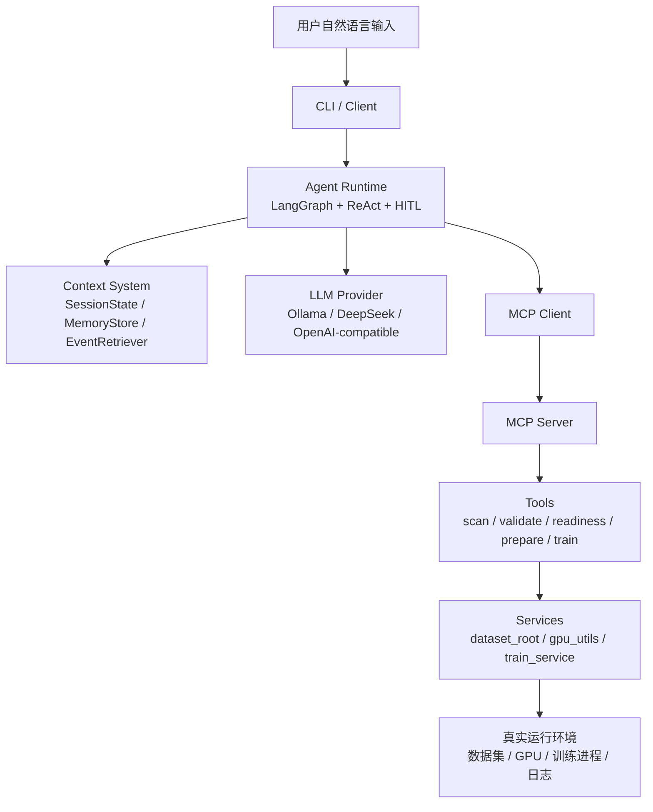
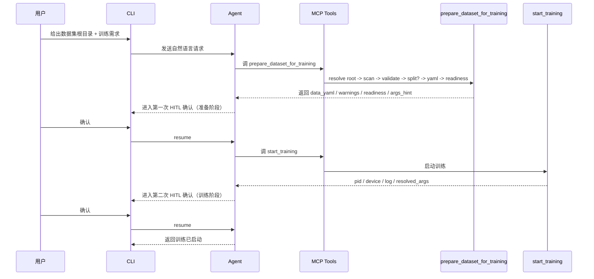
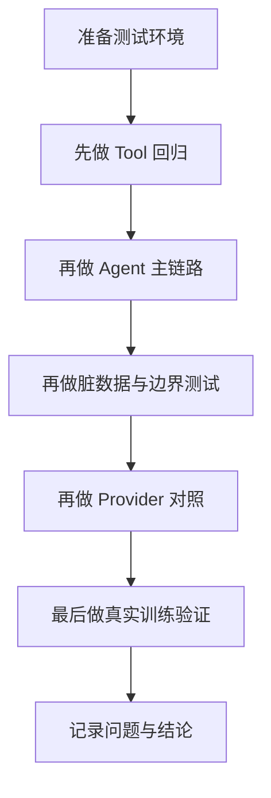

# YoloStudio Agent 测试作战手册（主线版）

> 目标：把这份文档作为 **每次主线开发完成后都能复用的测试手册**。  
> 它不是“随手记一点结果”的流水账，而是一个 **可重复执行、可逐轮扩展、可沉淀问题、可用于学习 Agent 测试方法** 的标准测试文档。

---

## 1. 这份文档是干什么的

这个项目不是普通聊天机器人，而是一个 **能理解自然语言、调用工具、处理数据、准备训练集、启动训练、查询训练状态、停止训练** 的工具型 Agent。

所以它的测试，不能只看：

- 能不能聊
- 会不会回复中文
- 能不能调用一个简单工具

真正要看的，是下面这些能力：

1. **理解能力**：能不能把自然语言理解成真实任务
2. **规划能力**：能不能把复杂任务拆成合理步骤
3. **工具能力**：能不能选对 tool，并给出对的参数
4. **状态能力**：能不能记住当前数据集、训练状态、待确认操作
5. **约束能力**：能不能遵守“只检查不训练”“先别动手”“高风险要确认”这类要求
6. **鲁棒性**：面对脏数据、非标准目录、长对话、MCP 重启、provider 差异时会不会翻车
7. **可解释性**：最终回答是不是 grounded，是否基于真实 tool 结果，而不是模型自由发挥

因此，这份文档的作用是：

- 定义一套 **稳定的测试流程**
- 给出一组 **可复制的话术模板**
- 区分 **主链路测试 / 边界测试 / 回归测试 / 脏数据测试 / Provider 对照测试**
- 把“这个系统目前的能力范围和已知边界”讲清楚

---

## 2. 当前项目的测试对象是什么

当前主线测试对象不是整个产品的所有功能，而是：

> **数据准备 → 训练准备 → 训练控制** 这条 Agent 主链路

也就是围绕以下业务闭环：

1. 用户给出自然语言任务
2. Agent 理解数据集路径和意图
3. Agent 调用 MCP tools
4. 工具层完成：扫描 / 校验 / 划分 / 生成 YAML / readiness
5. 高风险动作进入 HITL 确认
6. 训练启动
7. 训练状态可查
8. 训练可停止
9. 训练在 MCP 重启后可重新接管

---

## 3. 当前系统架构（测试视角）

### 3.1 总体分层图



### 3.2 为什么测试要按层分开

因为任何一次失败，可能来自不同层：

- 是 LLM 没理解？
- 是 tool 选错了？
- 是 tool 参数错了？
- 是服务层逻辑不对？
- 是数据集本身有问题？
- 是状态被污染了？
- 是训练进程丢了？

如果测试时不分层，就会出现一种常见误判：

> 明明是模型解释层在胡说，结果误以为工具层坏了。

所以这份手册会明确区分：

- **Tool 测试**
- **Agent 测试**
- **Provider 对照测试**
- **真实训练测试**
- **长上下文 / 状态恢复测试**

---

## 4. 当前主线工作流（你应该怎么理解）

### 4.1 标准 happy path

当用户说：

> 数据在某个目录里，请帮我准备好并训练

系统理想流程应该是：



### 4.2 为什么要分两段确认

因为这两类动作的风险不同：

1. **prepare_dataset_for_training**
   - 可能 split 数据
   - 可能生成新 YAML
   - 可能修改或新增数据准备产物

2. **start_training**
   - 会占 GPU
   - 会启动长任务
   - 会生成 run / log / 权重

如果把它们塞进一个超级工具里，会导致：

- HITL 粒度太粗
- 用户不知道自己确认了什么
- 出错时难排查

所以当前主线是合理的：

> **准备阶段** 与 **训练阶段** 分开确认

---

## 5. 为什么测试不能只看“会不会调用 tool”

工具型 Agent 最容易出现一种错觉：

> 只要它调了工具，就说明没问题。

这其实不对。真实测试要看 4 件事：

### 5.1 Tool 是否选对
例如：
- 应该用 `prepare_dataset_for_training`
- 结果模型绕去手动串 `scan + split + generate_yaml + readiness`

这虽然“也许最后能成”，但系统稳定性会差很多。

### 5.2 参数是否对
例如：
- 用户给的是 dataset root
- Agent 却把根目录直接当 `img_dir`

这会导致扫描数量错、后续流程都错。

### 5.3 结果解释是否 grounded
例如 tool 明明返回：
- `risk_level=critical`
- `missing_label_ratio=0.737`

模型最后却轻描淡写说：
- “可以直接训练，数据问题不大”

这就是解释层失真。

### 5.4 状态是否持续正确
例如：
- 当前没训练在跑
- 但 session 里还残留上次训练的 model / data_yaml / device

这会让下一轮推理被污染。

---

## 6. 测试应该怎么分层

### 6.1 Tool 层测试
目标：证明工具逻辑本身是对的。

典型问题：
- root resolver 是否正确
- classes.txt 是否被正确利用
- missing labels 是否被暴露为风险
- generate_yaml 是否保留真实类名
- auto device 是否解析正确

### 6.2 Agent 层测试
目标：证明模型 + runtime + tool 协作是对的。

典型问题：
- 复杂提示词是否能命中高层 tool
- 是否会遵守“只检查不训练”
- 是否会进入 HITL
- 取消后参数还能否回忆准确

### 6.3 Provider 对照测试
目标：识别同一系统在不同 LLM 下的行为边界。

典型问题：
- Gemma 是否更容易自由发挥
- DeepSeek 是否更 grounded
- 同一句话两个 provider 会不会走不同流程

### 6.4 真实训练测试
目标：证明不是“纸上调用”，而是真的能训练。

典型问题：
- start_training 真能起
- status 真能查
- stop 真能停
- MCP 重启后能否 reattach

### 6.5 状态与长上下文测试
目标：证明 memory 不是摆设。

典型问题：
- 扫描后说“那就训练 2 轮”能不能接上
- 取消后问“刚才待确认参数是什么”能不能说准
- fresh session 会不会被旧训练污染

---

## 7. 测试环境建议

每轮测试前，先明确：

### 7.1 Provider 维度
至少测两条：
- `ollama + gemma4:e4b`
- `deepseek + deepseek-chat`

原因：
- Gemma 更能暴露规划和解释层问题
- DeepSeek 更像稳定 API provider 参考线

### 7.2 数据集维度
至少准备 3 类：

#### A. 标准干净数据集
用途：测 happy path

#### B. 标准但脏的数据集
例如当前 `zyb`：
- 结构标准
- 大量缺失标签
- labels 目录带 `classes.txt`

用途：测真实世界数据质量问题

#### C. 非标准命名数据集
例如：
- `pics/`
- `ann/`

用途：测鲁棒性与容错

### 7.3 Session 维度
每轮复杂测试建议使用：
- 唯一 session id

不要长期复用一个默认 session 去做所有测试，否则容易把：
- 旧训练
- 旧数据集
- 旧确认状态

混进新测试，造成假问题。

---

## 8. 推荐测试流程（每轮版本都按这个来）



### 8.1 为什么先 Tool 再 Agent
因为如果 tool 自己就是错的，Agent 测试就会变成噪音。

### 8.2 为什么最后要做真实训练
因为“工具返回启动成功”不等于“训练真的能跑”。

---

## 9. 标准测试模板（每个 case 都按这个记）

每次测一个 case，都建议记录：

### 9.1 Case 基本信息
- Case 名称
- 测试时间
- Provider
- Session ID
- 数据集
- 是否允许训练

### 9.2 输入话术
把原始自然语言完整记录下来。

### 9.3 预期路径
例如：
- 应命中 `prepare_dataset_for_training`
- 再命中 `start_training`
- 或者只允许 `training_readiness`

### 9.4 实际路径
实际调用了哪些 tool。

### 9.5 实际结果
- 回复内容
- HITL 行为
- session state 变化
- 训练状态变化

### 9.6 结论分类
- 通过
- 部分通过
- 失败
- 工具正确但解释失真
- Provider 差异

### 9.7 问题归因
尽量分类为：
- Tool 逻辑问题
- 模型规划问题
- 解释层问题
- 状态污染问题
- 数据集问题
- 运行环境问题

---

## 10. 推荐的 20 条测试话术（可直接复用）

下面这部分是这份文档最实用的部分。  
每一条话术都不是为了“难为模型”，而是为了覆盖一个真实能力点。

---

### Case 1：标准 root + 直接判断
**话术**：
> 请检查这个数据集能不能直接训练：`/home/kly/test_dataset/`。不要启动训练，只告诉我结论和原因。

**测试点**：
- root 解析
- readiness
- “只检查不训练”约束

**看什么**：
- 是否命中 `training_readiness`
- 是否避免进入 `start_training`

---

### Case 2：标准 root + 默认划分 + 训练
**话术**：
> 数据在 `/home/kly/test_dataset/`，按默认划分比例，然后用 yolov8n 模型进行训练。

**测试点**：
- 复杂训练意图主线
- 是否命中两段式：prepare -> start_training

**看什么**：
- 是否先确认 prepare
- 再确认 training
- 是否不再空白

---

### Case 3：scan 后 follow-up
**话术 A**：
> 先扫描 `/home/kly/test_dataset/`。

**话术 B**：
> 那就训练 2 轮。

**测试点**：
- 上下文承接
- 数据集状态回写
- 默认参数继承

---

### Case 4：只 prepare，不训练
**话术**：
> 请把 `/home/kly/test_dataset/` 准备到可训练状态，但先不要启动训练。

**测试点**：
- `prepare_dataset_for_training`
- “不要训练”约束

---

### Case 5：脏数据总结
**话术**：
> 请分析 `/home/kly/agent_cap_tests/zyb` 这个数据集的质量问题，并列出最值得注意的风险。

**测试点**：
- 大数据脏数据解释
- missing labels
- classes.txt
- 风险表达 grounded 性

---

### Case 6：脏数据 + 只判断
**话术**：
> `/home/kly/agent_cap_tests/zyb` 现在适不适合直接训练？不要启动训练，只给我结论、风险、建议。

**测试点**：
- readiness 风险表达
- 是否区分“技术上可训练”和“数据质量差”

---

### Case 7：脏数据 + prepare
**话术**：
> 请把 `/home/kly/agent_cap_tests/zyb` 准备到可训练状态，但不要启动训练。我想看看你会生成什么 YAML。

**测试点**：
- prepare on dirty dataset
- classes.txt 语义保留
- YAML 结果是否合理

---

### Case 8：脏数据 + 训练主线
**话术**：
> 用 `/home/kly/agent_cap_tests/zyb` 这个数据集，按默认划分比例，用 yolov8n 开始训练。

**测试点**：
- 大数据脏数据主线
- 风险提示是否仍存在
- 是否仍可进入 train

---

### Case 9：非标准目录命名
**话术**：
> 帮我检查 `/home/kly/agent_cap_tests/nonstandard_dataset` 能不能训练。

**测试点**：
- `pics/ann` 容错
- 别名识别

---

### Case 10：真正未知目录
**话术**：
> 请准备 `/home/kly/agent_cap_tests/unknown_dataset` 这个数据集用于训练。

**测试点**：
- unknown 结构失败点前移
- 是否在 resolve_root 阶段就阻断
- 是否给出恢复建议

---

### Case 11：训练状态分支
**话术**：
> 如果现在有训练在跑就停止；如果没有，就只告诉我现在没有训练。

**测试点**：
- 分支逻辑
- 不误启训练
- fresh session 状态纯净性

---

### Case 12：取消后参数回忆
**话术 A**：
> 用 `/home/kly/test_dataset/` 按默认比例准备并训练 yolov8n。

在训练确认时取消，然后问：

**话术 B**：
> 刚才待确认的训练参数是什么？

**测试点**：
- pending confirmation 持久化
- 参数回忆精度

---

### Case 13：禁止训练约束
**话术**：
> 只允许做检查，不允许启动训练。请看看 `/home/kly/test_dataset/` 是否可以直接训练。

**测试点**：
- 强约束 obey
- 避免高风险动作

---

### Case 14：解释层 grounded 性
**话术**：
> 请精确列出 `/home/kly/agent_cap_tests/zyb` 当前已知的类别名、缺失标签数量、风险等级。

**测试点**：
- 是否复用 tool 结果
- 是否少编造

---

### Case 15：provider 对照
**话术**：
> 数据在 `/home/kly/test_dataset/`，按默认划分比例，然后用 yolov8n 模型进行训练。

分别在：
- Gemma
- DeepSeek

上执行。

**测试点**：
- 是否走相同主线
- 是否同样命中 prepare -> start_training
- 是否 split 决策一致

---

### Case 16：MCP 重启后状态接管
**步骤**：
1. 启动一个长一些的训练
2. 重启 MCP
3. 再问训练状态
4. 再停止训练

**测试点**：
- run registry
- reattach
- stop by pid

---

### Case 17：长上下文多轮
**流程**：
1. 扫描一个数据集
2. 校验
3. 问风险
4. 让它准备
5. 再问“那就训练 2 轮”
6. 再问“刚才用的是哪个 YAML”

**测试点**：
- SessionState
- MemoryStore
- EventRetriever
- tool 结果回写

---

### Case 18：GPU 规则解释
**话术**：
> 如果现在开始训练，会用哪张卡？这是我指定的，还是系统自动推断的？

**测试点**：
- `auto_device`
- `device_policy`
- “用户指定 vs 系统解析”的解释边界

---

### Case 19：准备产物追问
**话术 A**：
> 把 `/home/kly/test_dataset/` 准备到可训练状态，但先别训练。

**话术 B**：
> 你刚才生成了什么？用了哪个 YAML？为什么这么做？

**测试点**：
- prepare 产物解释
- `recommended_start_training_args`
- 状态回写质量

---

### Case 20：极简指令恢复能力
**话术 A**：
> 扫描 `/home/kly/test_dataset/`

**话术 B**：
> 行，那就开始。

**测试点**：
- 短指令承接能力
- 从上下文恢复真实意图
- 不要过度猜测

---

## 11. 对话话术怎么写更有测试价值

很多人做 Agent 测试时，只会写这种话：

- “帮我训练一下”
- “看看这个数据集”
- “能不能用”

这些话可以测，但覆盖率不够高。

更好的测试话术，应该具备以下几类特征：

### 11.1 带约束
例如：
- 不要启动训练
- 只检查
- 如果不能直接训练，再做下一步

这能测 **执行边界**。

### 11.2 带分支
例如：
- 如果在训练就停，不在就汇报

这能测 **条件判断**。

### 11.3 带多步
例如：
- root -> split -> train

这能测 **规划能力**。

### 11.4 带追问
例如：
- 刚才待确认参数是什么
- 你刚才生成了什么 YAML

这能测 **状态能力**。

### 11.5 带脏数据
例如：
- labels 里有 classes.txt
- 大量缺失标签
- 非标准目录名

这能测 **鲁棒性**。

---

## 12. 当前版本已知容易出问题的地方

下面这些问题，是当前版本测试时需要重点盯住的，不是理论问题，而是已经暴露过的真实问题类型。

### 12.1 Gemma 的解释层会说过头
表现：
- 执行链路是对的
- 但自然语言总结会超出工具事实
- 会编造评估、结果、路径或参数细节

### 12.2 取消后参数回忆不够稳
表现：
- 能记住这是一次训练
- 但 `epochs / data_yaml / device` 容易漂

### 12.3 非标准目录仍可能有边界
虽然 `pics/ann` 已增强，但真实世界还可能出现：
- `imgs/targets/`
- `JPEGImages/Annotations/`
- 图像和标签不在同一层

这类仍需继续观察。

### 12.4 脏数据风险容易被解释层弱化
工具层已经能给出：
- risk_level
- warnings
- missing_label_ratio

但模型回答时可能轻描淡写。

### 12.5 provider 之间仍可能有策略差异
Gemma 和 DeepSeek：
- 对 split 是否必要
- 对默认模型是否补全
- 对 auto device 如何解释

仍可能存在轻微差异。

---

## 13. 如果测试失败，怎么记录才有价值

不要只写：
- “失败了”
- “这个不行”
- “模型不太聪明”

要尽量这样写：

### 13.1 失败描述
- 输入是什么
- 预期是什么
- 实际发生了什么

### 13.2 失败层级判断
尽量判断问题更像发生在：
- LLM 规划层
- tool 选择层
- tool 参数层
- service 逻辑层
- runtime 层
- 状态层
- 解释层

### 13.3 是否可稳定复现
- 总是复现
- 偶尔复现
- 只在 Gemma 复现
- 只在 DeepSeek 复现

### 13.4 是否影响主线
有些问题是：
- 会让系统完全做不成事

有些只是：
- 做成了，但回答不够精确

这两类优先级完全不同。

---

## 14. 建议采用的测试节奏

### 每次代码主线变更后
至少做：
1. Tool 冒烟
2. 主链路复杂提示词
3. dirty dataset 一组
4. provider 对照一组
5. 真实训练一组

### 每次大版本节点
再加：
1. 长上下文回归
2. MCP 重启接管
3. 取消后参数回忆
4. 非标准目录容错

---

## 15. 我对这个测试方法的建议

这是你特别问到的部分：

> 这种“先写测试文档，再按文档指导每次测试”的想法怎么样？

我的结论是：

> **这是对的，而且对 Agent 项目尤其重要。**

原因有 5 个：

### 15.1 Agent 问题很容易漂
普通功能测试，接口对不对通常比较稳定。  
但 Agent 的问题可能会随着：
- prompt
- provider
- 上下文
- tool return
- 数据集
- session 历史

而漂移。

所以必须靠**固定测试手册**稳住比较基线。

### 15.2 Agent 最怕“印象流测试”
如果每次只凭感觉聊几句，会出现：
- 这次感觉不错
- 下次感觉也还行
- 但其实主线某个能力已经退化了

测试文档的价值，就是把“感觉”变成“可重复执行的标准动作”。

### 15.3 Agent 项目必须区分“执行对了”和“解释对了”
你这个项目已经明显进入这个阶段：
- 工具执行链越来越稳
- 解释层 still drifts

如果没有文档，大家很容易把这两类问题混在一起。

### 15.4 文档会反向逼着架构更清晰
一旦你发现某条测试话术总是很难描述，往往意味着：
- tool 太底层
- 流程太绕
- 规则不够清楚

所以测试文档不只是测系统，也会帮助你反向优化系统设计。

### 15.5 后面加功能时也能沿用
当你后面开始加：
- 预测
- 批处理
- 实验管理
- 推理任务

这份手册的结构依然能继续扩展，而不是重来。

---

## 16. 我对你后续测试方式的具体建议

### 建议 1：固定一套“主线回归集”
最少保留 6 条：
- 标准 root + 只检查
- 标准 root + prepare + train
- 脏数据只检查
- 脏数据 prepare
- 取消后参数回忆
- MCP 重启后训练接管

### 建议 2：每次都要有一个“脏数据集”
不要只测干净小数据。  
真实项目最值钱的问题，往往都是脏数据测出来的。

### 建议 3：Provider 必须双跑
至少：
- Gemma
- DeepSeek

因为两者的差异，正好能帮你分辨：
- 是系统设计问题
- 还是模型能力问题

### 建议 4：所有复杂测试都用唯一 session
否则你会被历史状态污染。

### 建议 5：每个测试都分“执行层评分”和“解释层评分”
比如：
- 执行层：8/10
- 解释层：5/10

这样你会更快看清当前短板在哪里。

### 建议 6：问题文档和测试文档要配套使用
- 测试文档负责告诉你“怎么测”
- issue inventory 负责告诉你“已经发现了什么”

二者结合，项目推进才不会散。

---

## 17. 当前版本总体判断（测试视角）

如果只从测试和主线能力角度看，我对当前系统的判断是：

### 已经比较强的
- 标准 YOLO 数据集主线
- root → prepare → train 两段式流程
- HITL
- MCP 重启后的训练接管
- dirty dataset 下的风险表达（工具层）
- DeepSeek 作为 API provider 的稳定性

### 仍需重点观察的
- Gemma 的解释 grounded 性
- 取消后参数回忆
- 非标准目录的进一步容错
- provider 对复杂训练意图的解释一致性

### 当前结论
> 这个系统已经不是“能演示”的阶段，而是进入了“必须用一套标准化测试文档来压住漂移”的阶段。

这也是为什么这份手册值得长期保留。

---

## 18. 后续如何维护这份文档

建议每次版本推进后，做两类更新：

### 18.1 不变部分
这些可以长期保留：
- 测试哲学
- 分层方法
- 标准模板
- 推荐流程

### 18.2 每轮更新部分
这些要随着项目更新：
- 当前已知问题
- 推荐测试案例
- provider 差异结论
- 当前主线能力边界

---

## 19. 测试产物清理与环境复位

测试文档不能只写“怎么测”，还要写“测完怎么收场”。

因为这个项目的很多测试不是纯只读的，而是会产生派生产物，例如：

- `images_split/`
- `pics_split/`
- `data.yaml`
- 训练日志
- runs 目录
- registry 文件

如果每轮测试都只测不清理，会出现两个问题：

1. **测试之间互相污染**
   - 上一轮生成了 split 目录
   - 下一轮 readiness 可能直接把它当现成产物
   - 导致测试结果不再纯净

2. **环境越来越脏**
   - 目录越来越多
   - 日志越来越多
   - 很难分辨哪些是基准数据，哪些是测试副产物

### 19.1 当前已经提供的安全清理脚本

本项目已经有一个专门用于清理 split 类测试产物的脚本：

- 本地路径：`D:\yolodo2.0\agent_plan\deploy\scripts\cleanup_split_artifacts.sh`（不可以在本地运行这个脚本，因为不在本地进行数据划分）
- 服务器路径：`/home/kly/yolostudio_agent_proto/cleanup_split_artifacts.sh`

### 19.2 这个脚本解决什么问题

它解决的是：

> **测试后如何安全清理 split 派生产物，而不误删原始数据。**

它不是一个“随便删点目录”的脚本，而是带了明确的安全约束：

1. **白名单根目录限制**
   - 只允许清理：
     - `/home/kly/test_dataset`
     - `/home/kly/agent_cap_tests`
     - `/home/kly/test_dataset_split_for_yaml`

2. **目标目录显式枚举**
   - 不是模糊通配全盘删除
   - 只删除已知 split-like 目录

3. **目标类型校验**
   - 必须看起来像 split 产物
   - 避免误删原始 images/labels

4. **先 list，再 clean**
   - 默认只是查看
   - 必须显式传 `clean` 才删除

### 19.3 推荐使用方式

#### 第一步：先 dry-run

```bash
/home/kly/yolostudio_agent_proto/cleanup_split_artifacts.sh list
```

作用：
- 看当前有哪些 split 产物
- 检查目标是否符合预期

#### 第二步：确认后再清理

```bash
/home/kly/yolostudio_agent_proto/cleanup_split_artifacts.sh clean
```

作用：
- 删除脚本白名单中的 split 派生产物

#### 第三步：清理后复查

再次执行：

```bash
/home/kly/yolostudio_agent_proto/cleanup_split_artifacts.sh list
```

理想结果应为：
- `existing_targets=0`

### 19.4 当前脚本覆盖范围

当前它**只清理 split 类派生产物**，不会清理：

- 原始 `images/`
- 原始 `labels/`
- 训练 `runs/`
- `train_log_*.txt`
- `active_train_job.json / last_train_job.json`
- augmented 目录

所以它适合用于：

> **每轮数据准备测试之后，把 split 环境恢复干净。**

### 19.5 建议把清理步骤写进每轮测试流程

建议以后每次执行：

- `prepare_dataset_for_training`
- `split_dataset`
- 脏数据集大规模测试

之后，都加一个固定收尾动作：

1. `list`
2. `clean`
3. `list` 复查

这能保证：
- 主线回归更纯净
- 测试结果更可复现
- 服务器环境不越来越脏

---

## 20. 一句话总结

> **这份手册的意义，不是教你怎么“跟 Agent 聊天”，而是教你怎么把一个工具型 Agent 当成工程系统来测试。**

真正好的 Agent 测试，不是“它这次看起来挺聪明”，而是：

- 它在固定流程里是否稳定
- 它在脏数据下是否可靠
- 它在复杂任务里是否可解释
- 它在不同 provider 下是否一致
- 它出错时是否能被定位和复现

如果这五件事能持续做，你这个项目就会越来越像一个真正可交付的系统，而不是一个偶尔表现不错的 demo。


## 20. 数据健康与重复检测专项

### 20.1 图片健康检查（只读）
- 推荐话术：`请检查这个数据集的图片是否有损坏、尺寸异常或重复图片，但不要修改原始数据。`
- 预期路径：`run_dataset_health_check(dataset_path=...)`
- 重点检查：
  - 是否正确解析 dataset root
  - 是否返回 `risk_level / warnings / issue_count`
  - 是否区分完整性问题、尺寸异常、重复图片
  - 是否在需要时给出 `report_path`
- 常见问题：
  - 模型只口头总结、不调用工具
  - 把只读检查误说成会修改数据
  - 回答时遗漏 `warnings` 里的关键风险

### 20.2 重复图片检测（只读）
- 推荐话术：`帮我找出这个数据集里重复的图片，并给我几组样例路径，不要删除任何文件。`
- 预期路径：`detect_duplicate_images(dataset_path=..., method='md5')`
- 重点检查：
  - 是否返回 `duplicate_groups / duplicate_extra_files / groups`
  - 是否能基于样例组做 grounded 回答
  - 是否明确说明当前只是检测，没有执行清理
- 常见问题：
  - 模型把“检测重复”误说成“已经去重”
  - 回答中编造不存在的重复组或路径
  - 将 `auto` 或默认参数误描述成用户显式指定

## 21. 主线回归矩阵（2026-04-11 增补）

当系统复杂度继续上升后，建议每轮主线开发完成后，不再只跑零散 smoke，而是固定跑一轮“主线回归矩阵”。

### 21.1 推荐矩阵覆盖
至少覆盖 4 层：

1. **Tool 层**
   - 标准 root 解析
   - unknown 目录早失败
   - 非标准目录容错
   - dirty dataset 健康检查
   - dirty dataset readiness 风险表达

2. **Gemma Agent 层**
   - 标准 root + 只检查不训练
   - 标准 root + 复杂训练意图
   - dirty dataset 风险总结
   - 健康检查 grounded 回复
   - 重复检测 grounded 回复
   - fresh session 状态纯净性

3. **DeepSeek Agent 层**
   - 与 Gemma 跑同一组高价值 case，用于对照系统问题与 provider 问题

4. **补充回归**
   - `test_prepare_dataset_flow.py`
   - `test_training_state_purity.py`
   - `test_train_run_registry.py`

### 21.2 当前矩阵脚本
- `D:\yolodo2.0\agent_plan\agent\tests\test_mainline_regression_matrix.py`

### 21.3 当前矩阵输出
- JSON：`D:\yolodo2.0\agent_plan\agent\tests\test_mainline_regression_matrix_output.json`
- 报告：`D:\yolodo2.0\agent_plan\doc\mainline_regression_matrix_report_2026-04-11.md`

### 21.4 为什么这个矩阵有价值
它不是只看“会不会调用 tool”，而是同时检查：
- 执行层是否完成
- 状态层是否被污染
- 解释层是否 grounded
- provider 是否存在一致性分叉

### 21.5 当前矩阵最典型暴露的问题
- Gemma 在“只检查不训练”“脏数据总结”“健康检查/重复检测”上的解释层仍明显弱于执行层
- Gemma 仍会尝试调用不存在的桌面风格旧工具名（如 `detect_duplicates`、`detect_corrupted_images`、`dataset_manager.prepare_dataset`）
- DeepSeek 主线执行更稳，但在 dirty summary / health grounded 上仍有少量未满分项
- unknown 目录早失败行为已经正确，但错误语义还可以继续收紧

## 22. 训练轮数与观察窗口建议（2026-04-11 增补）

当前测试里已经出现过一个实际问题：

- 数据集较小
- 显卡性能较强
- 训练轮数太少（如 1~3 epochs）

导致：
- 还没来得及做中途状态分析，训练就已经结束
- `check_training_status` 拿到的是“已完成”而不是“运行中”
- 容易让我们误判训练状态、指标解析、stop/reattach 是否工作正常

### 22.1 以后训练测试建议分三档

#### A. 连接冒烟档
用途：
- 验证训练能否成功启动
- 验证参数是否正确传递

建议：
- `2~3 epochs`
- 只用于 very fast smoke，不用于生命周期分析

#### B. 生命周期标准档（推荐）
用途：
- 验证 `start -> status -> status -> stop`
- 验证中途日志解析
- 验证运行态指标

建议：
- **优先 20~30 epochs**
- 或者保证训练至少持续 **90~180 秒**
- 至少做 **2~3 次中途 status 查询**

这是以后最应该作为主线训练测试默认档位的配置。

#### C. 长任务恢复档
用途：
- 验证 MCP 重启后的 reattach
- 验证 registry
- 验证 long-running 任务接管

建议：
- **30~50 epochs**
- 在训练进行中重启 MCP
- 重启后再查 status，再 stop

### 22.2 推荐测试动作
对于主线训练验证，以后建议默认按下面的节奏走：

1. 启动一个 **20~30 epochs** 的训练
2. 等待 10~20 秒，查第一次状态
3. 再等待 20~40 秒，查第二次状态
4. 如果要测 stop，就在中段执行 stop
5. 如果要测 reattach，就在运行中重启 MCP 再查状态

### 22.2.1 推荐训练数据集选择
为了避免训练过快结束，主线训练测试默认按下面的数据集优先级选择：

1. **生命周期 / 中途观察测试**
   - 优先使用：`/home/kly/agent_cap_tests/zyb`
   - 原因：
     - 数据量更大
     - 脏数据更多
     - 更容易观察 `status / metrics / stop`
     - 更能测出 dirty dataset 风险表达是否稳定

2. **MCP 重启接管 / reattach 测试**
   - 优先使用：`/home/kly/agent_cap_tests/zyb`
   - 推荐：
     - `30~50 epochs`
     - 训练启动后至少观察 1~2 次状态再重启 MCP

3. **快速 smoke / 参数连通性验证**
   - 使用：`/home/kly/test_dataset`
   - 推荐：
     - `2~3 epochs`
   - 只用于验证：
     - 参数有没有传对
     - 训练能不能启动
   - 不用于判断：
     - 生命周期
     - 指标解析稳定性
     - reattach 能力

### 22.3 为什么这样更合理
因为我们现在已经不是只测“能不能起训练”，而是在测：
- 训练状态查询是否可靠
- metrics 解析是否可靠
- stop 是否可靠
- MCP 重启后接管是否可靠

这些都要求：
> **训练必须在一个足够长的观察窗口里运行。**

### 22.4 当前执行建议
从下一轮开始：
- **不要再把 1~3 epochs 当主线训练验证的默认轮数**
- 主线默认改为：
  - `20~30 epochs`（生命周期测试）
  - `30~50 epochs`（恢复接管测试）

短轮数训练只保留给：
- 快速 smoke
- 参数连通性验证
