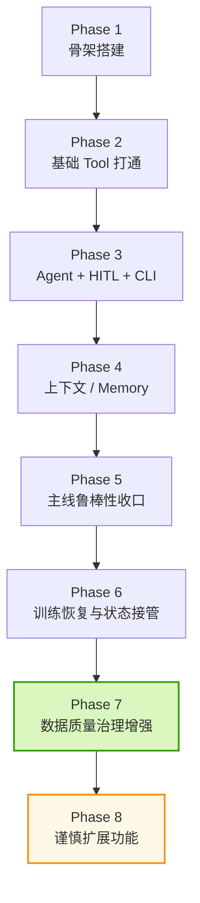

# YoloStudio Agent 项目连续进展（2026-04-11）

> 用途：这是一份给“中断后续上”的连续进展文档。
> 如果后续会话要快速进入状态，优先阅读本文件，再结合 `doc/project_summary.md`、`doc/current_progress_2026-04-09.md`、`doc/agent_test_playbook_2026-04-10.md` 使用。

---

## 1. 当前项目状态一句话总结

截至 2026-04-11，项目已经从“能不能做”推进到：

> **第一主线（数据准备 → 训练）已经形成稳定闭环，并进入“数据质量治理增强 + 测试体系加强 + 可谨慎扩展功能”的阶段。**

更直白一点：

- 不是概念验证了
- 不是只能演示 happy path 了
- 已经能在真实数据、真实训练、真实远端环境下工作
- 当前主要矛盾从“没有能力”转成了：
  - 解释层 grounded 性
  - 弱模型（Gemma）对现有工具契约的贴合度
  - durable checkpoint / persistent HITL
  - 第二主线开启前的测试与稳态收口

---

## 2. 当前主线是什么

当前**第一主线**不是“把所有桌面功能 Agent 化”，而是：

> **让用户通过自然语言，把数据集送进系统，完成数据准备、训练前判断、训练启动、训练状态查询、训练停止和恢复接管。**

用流程图表示：

---

## 3. 当前主线位置

目前可以把主线阶段分成下面 8 段：

### 当前位置判断

**当前在 Phase 7，且已经接近 Phase 8。**

也就是说：

- 主线基础闭环：完成
- 主线鲁棒性：大部分完成
- 训练恢复能力：完成
- 数据质量治理：第一批已完成
- 功能扩展：可以谨慎开始，但最好继续保持“主线优先”原则

---

## 4. 当前架构快照

### 4.1 架构分层

### 4.2 当前已注册工具（13 个）

1. `scan_dataset`
2. `split_dataset`
3. `validate_dataset`
4. `run_dataset_health_check`
5. `detect_duplicate_images`
6. `augment_dataset`
7. `generate_yaml`
8. `training_readiness`
9. `prepare_dataset_for_training`
10. `start_training`
11. `check_training_status`
12. `stop_training`
13. `check_gpu_status`

---

## 5. 这段时间主线推进了什么

下面按“问题 → 解决 → 价值”来写，不按流水账写。

### 5.1 从“根目录歧义”到 dataset root resolver

#### 遇到的问题
用户经常说：
- `数据在 /home/kly/test_dataset/`

但工具真正需要的往往是：
- `images/`
- `labels/`

最早时，Agent 会把 dataset 根目录直接当 `img_dir`，导致扫描数量虚高、后续流程偏掉。

#### 怎么解决的
引入了：
- `server/services/dataset_root.py`
- `prepare_dataset_for_training`

现在能够：
- 识别标准 `images/labels`
- 识别常见别名，如 `pics/ann`
- 对 truly unknown 结构在 `resolve_root` 阶段尽早失败

#### 价值
这一步本质上是把“用户的人话”翻译成“工具真正可用的路径结构”。

---

### 5.2 从“复杂提示词不稳”到两段式主线

#### 遇到的问题
这类输入一开始不稳：
- `数据在 /home/kly/test_dataset/，按默认划分比例，然后用 yolov8n 模型进行训练`

问题包括：
- 空白回复
- 模型只做一半
- 模型自己乱拼底层步骤

#### 怎么解决的
把主线收成两段式：
1. `prepare_dataset_for_training`
2. `start_training`

并加了：
- 参数来源显式化
- `recommended_start_training_args`
- 主线控制器 fallback

#### 价值
这是典型的“workflow 替代过度自由 agent”。

---

### 5.3 从“写死 GPU 假设”到真实资源策略

#### 遇到的问题
最早很容易把 GPU 规则写死成：
- 哪张卡给 LLM
- 哪张卡给训练
- 永远单卡 / 永远多卡

这在切 provider、切部署方式时会失真。

#### 怎么解决的
引入：
- `gpu_utils.py`
- 真实查询 GPU busy / idle / free memory
- 策略：
  - `single_idle_gpu`
  - `all_idle_gpus`
  - `manual_only`

#### 价值
GPU 规则不再依赖“想象中的部署方式”，而是依赖真实运行状态。

---

### 5.4 从“训练一重启就失联”到 run registry

#### 遇到的问题
训练一旦启动后，如果 MCP 重启：
- `_process` 句柄丢失
- Agent 失去状态
- 无法再继续查状态或 stop

#### 怎么解决的
引入：
- `runs/active_train_job.json`
- `runs/last_train_job.json`
- fresh `TrainService()` 自动 reattach

#### 价值
主线从“能启动训练”提升到了“能接管长期运行中的训练”。

---

### 5.5 从“能看见脏数据”到“会表达脏数据风险”

#### 遇到的问题
在 `zyb` 这种大数据脏数据集上，系统能看到：
- 大量缺失标签
- labels 下存在 `classes.txt`

但最早时这些信息没有稳定提升为：
- readiness 风险
- 真实类名保留

#### 怎么解决的
增强了：
- `scan_dataset`
- `validate_dataset`
- `training_readiness`
- `prepare_dataset_for_training`
- `generate_yaml`

现在能返回：
- `missing_label_images`
- `missing_label_ratio`
- `risk_level`
- `warnings`
- `detected_classes_txt`
- `class_name_source`

并且生成 YAML 时优先保留真实类名。

#### 价值
数据质量开始成为主线的一部分，而不是训练前的“附带说明”。

---

### 5.6 从“训练主线”延伸到“数据治理增强”

#### 遇到的问题
真实数据集（尤其本地大数据集）暴露出一类新需求：
- 损坏图片
- 格式不匹配
- 重复样本

这些问题不属于狭义训练控制，但又直接影响训练质量。

#### 怎么解决的
新增 Agent 化工具：
- `run_dataset_health_check`
- `detect_duplicate_images`

它们和桌面版不同，做了 Agent 适配：
- 输入更贴近语义（`dataset_path`）
- 输出结构化（`summary / warnings / risk_level / next_actions`）
- 默认只读，不直接改数据
- grounded reply 优先基于工具结果生成

#### 价值
主线开始具备“训练前治理”能力，而不是只会“准备完就训”。

---

## 6. 当前已经解决掉的代表性问题

| 问题 | 根因 | 解决方式 | 当前状态 |
|---|---|---|---|
| dataset 根目录被误当 img_dir | 用户语义与工具参数不一致 | dataset root resolver + prepare 工具 | 已解决 |
| 复杂训练提示词空白或停半路 | 模型规划负担过高 | 两段式流程 + fallback | 已解决主线大部分 |
| GPU 规则写死 | 早期假设过多 | 动态 GPU 分配策略 | 已解决 |
| MCP 重启后训练失联 | 运行态只在内存里 | run registry + reattach | 已解决 |
| classes.txt 语义丢失 | YAML 生成未利用类名来源 | 优先使用 classes.txt | 已解决 |
| 大量缺失标签不进风险提示 | 工具能看到但没提升为风险 | readiness / validate 增强 | 已解决主要部分 |
| 健康检查需要桌面依赖 | core 引入链带 Qt | headless PySide6 fallback | 已解决 |
| split 测试产物越积越多 | 没有统一清理流程 | `cleanup_split_artifacts.sh` + 测试手册 | 已解决当前范围 |

---

## 7. 当前还没彻底解决的问题

这些是现在最值得继续盯住的，不是“未知风险”，而是已经被测试证明会出现的边界。

### 7.1 Gemma 的工具契约贴合度不足
最典型表现：
- 幻觉旧工具名
  - `dataset_manager.prepare_dataset`
  - `detect_duplicates`
  - `detect_corrupted_images`
- 幻觉旧参数名
  - `path`
  - 而不是现在要求的 `dataset_path`

这说明：
- 问题不主要在 memory
- 而在于 **Gemma 对当前工具体系的 schema 贴合度不够**

### 7.2 Gemma 的解释层明显弱于执行层
表现：
- 工具调用有时是对的
- 但最终解释会说过头、说偏或回退到空回复 fallback

### 7.3 durable checkpoint / persistent HITL 还没做
当前仍然是：
- `MemorySaver()`

这意味着：
- 会话级 interrupt/hitl 仍偏原型级
- 还没到长期稳态的持久化执行形态

### 7.4 CLI 恢复提示还可以更强
现在已经有 fallback，但还可以更明确：
- 为什么失败
- 建议改怎么说
- 建议换哪个 tool 路径

---

## 8. 这段时间参考了哪些资料

以下资料对当前项目推进起了直接作用：

### Agent / Workflow / Persistence
- [LangGraph Workflows and Agents](https://docs.langchain.com/oss/python/langgraph/workflows-agents)
- [LangGraph Persistence](https://docs.langchain.com/oss/python/langgraph/persistence)
- [LangGraph Interrupts](https://docs.langchain.com/oss/python/langgraph/interrupts)

### Tool calling / schema / structured outputs
- [OpenAI Structured Outputs](https://platform.openai.com/docs/guides/structured-outputs)
- [Anthropic Tool Use Overview](https://docs.anthropic.com/en/docs/agents-and-tools/tool-use/overview)
- [Anthropic Tool Use Implementation](https://docs.anthropic.com/en/docs/agents-and-tools/tool-use/implement-tool-use)
- [Ollama Tool Calling](https://docs.ollama.com/capabilities/tool-calling)

### MCP / 服务协议
- [Model Context Protocol - Transports](https://modelcontextprotocol.io/specification/2025-06-18/basic/transports)
- [Model Context Protocol - Authorization](https://modelcontextprotocol.io/specification/2025-06-18/basic/authorization)

这些资料的作用，不是“照抄实现”，而是帮助确定：
- 哪些部分应该 workflow 化
- 哪些部分应该 contract 化
- 哪些部分需要持久化
- 哪些地方不能继续只靠 prompt 修修补补

---

## 9. 这段过程里得到的经验

### 9.1 Agent 系统不能只看“会不会调工具”
真正要分开看：
- 执行层
- 状态层
- 解释层

很多时候：
- 执行层已经对了
- 但解释层还在胡说

### 9.2 弱模型更需要 workflow 和 alias 防御
Gemma 这轮测试很清楚地说明：
- prompt 不够
- 只靠“让模型自己选对工具”也不够

要补：
- alias 层
- workflow 路由
- grounded renderer

### 9.3 主线一定要先收口，再扩功能
如果第一主线都不稳，继续扩：
- 预测
- 批处理
- 更复杂的数据治理

只会把问题放大。

### 9.4 脏数据集比 toy dataset 更值钱
`zyb` 这类数据带来的信息密度，远高于小型干净数据。  
真正有价值的问题，往往是在 dirty dataset 上暴露出来的。

### 9.5 测试不能只靠“印象流”
现在已经进入必须靠：
- 固定回归用例
- 标准测试手册
- 主线回归矩阵
- issue inventory

来压住漂移的阶段。

---

## 10. 当前测试体系状态

### 已经有的测试资产
- smoke tests
- 长上下文测试
- 脏数据集压力测试
- `zyb` 10 方法测试
- 主线测试手册
- split 测试清理脚本
- **主线回归矩阵**（2026-04-11 新增）

### 最新一轮主线矩阵结果
- case 数：17
- 检查项通过：48/64
- 总分：0.75

### 这个结果说明什么
- 工具层和服务层已经比较稳
- DeepSeek 路线整体明显更稳
- Gemma 路线的主要问题集中在：
  - 旧工具名幻觉
  - 旧参数名幻觉
  - grounded 回复不足

---

## 11. 当前最合理的下一步

如果继续按主线推进，当前最合理的优先级是：

### 第一优先：收口 Gemma 的旧工具/旧参数幻觉
建议做：
- tool alias / 参数 alias 防御层
- prompt 再明确“只允许当前注册工具名”
- 对典型旧名做映射

### 第二优先：扩大 grounded reply 覆盖
优先扩到：
- `training_readiness`
- `prepare_dataset_for_training`
- `scan_dataset`
- `validate_dataset`

### 第三优先：durable checkpoint / persistent HITL
这是当前“主线尾巴”里最系统性的一个缺口。

### 第四优先：然后再正式开启第二主线
第二主线更适合优先做：
- 预测 / 批处理推理
而不是先上实时流媒体或更重的 GUI 绑定能力。

---

## 12. 中断后如何续上

如果后续对话中断，建议这样恢复：

1. 先读：
   - `doc/project_summary.md`
   - `doc/current_progress_2026-04-09.md`
   - `doc/agent_test_playbook_2026-04-10.md`
   - `doc/mainline_regression_matrix_report_2026-04-11.md`

2. 再看：
   - `agent/tests/test_mainline_regression_matrix_output.json`

3. 如果继续按主线推进，默认从这三个点中选一个：
   - Gemma alias 防御层
   - grounded reply 扩展
   - durable checkpoint

---

## 13. 最后一段判断

> 当前项目已经不是“要不要继续做 Agent”的问题，而是“第一主线已经基本站稳，正在收最后几块工程化短板，并准备打开第二主线”的问题。
> 如果中断后要继续推进，这份文档可以作为新的连续起点。
