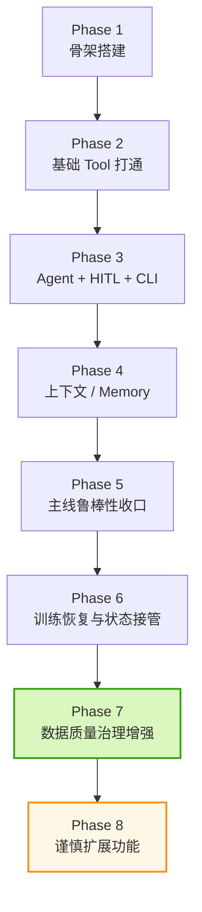
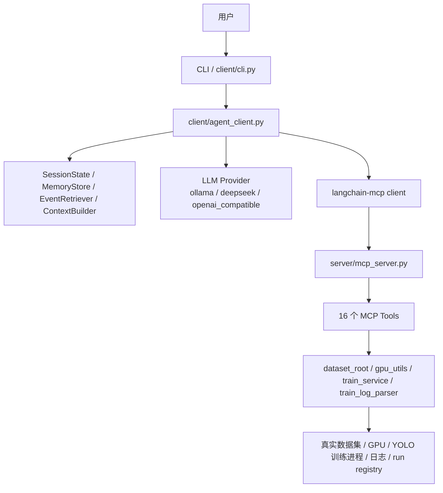

# YoloStudio Agent 项目连续进展（2026-04-11）

> 用途：这是一份给“中断后续上”的连续进展文档。
> 如果后续会话要快速进入状态，优先阅读 `doc/new_conversation_handoff_2026-04-11.md`、`doc/conversation_context_handoff.md` 和本文件，再结合 `doc/project_summary.md`、`doc/current_progress_2026-04-09.md`、`doc/agent_test_playbook_2026-04-10.md` 使用。

---

## 1.3 2026-04-11 深夜新增：数据提取链第一批已落地

这轮没有再横向堆功能，而是按 Agent-first 路线把 `D:\yolodo2.0` 里高价值的数据提取能力接进来了。

### 已新增的 Agent 工具

- `preview_extract_images`
- `extract_images`
- `scan_videos`
- `extract_video_frames`

### 当前已验证的能力

- 图片抽取支持 **预览 / 真执行** 两段式
- 输入参数已改成 Agent 友好的 `source_path / output_dir / selection_mode / count / ratio / grouping_mode`
- 输出已结构化，且会返回：
  - `summary`
  - `warnings`
  - `artifacts`
  - `workflow_ready_path`
  - `next_actions`
- `extract_images` 的 flat 输出可直接接：
  - `scan_dataset`
  - `validate_dataset`
  - `prepare_dataset_for_training`
- `scan_videos` 已完成本地与远端 smoke
- `extract_video_frames` 已完成本地工具级验证

### 当前边界

- 远端 `yolostudio-agent-server` 环境当前缺少 `cv2` / `numpy`
- 随后已为远端 `yolostudio-agent-server` 环境补齐 `cv2 / numpy`，并完成真实视频目录抽帧 smoke；当前 `extract_video_frames` 已可在远端实际执行
- 图片抽取和视频扫描已经同步到远端并可用；视频抽帧的远端可用性还差运行环境依赖补齐

### 本轮直接验证结果

本地通过：
- `agent/tests/test_extract_tools.py`
- `agent/tests/test_video_extract_tools.py`
- `agent/tests/test_extract_route.py`
- `agent/tests/test_prepare_dataset_flow.py`
- `agent/tests/test_predict_tools.py`

远端通过：
- `preview_extract_images` smoke
- `extract_images` smoke
- `scan_videos` smoke
- 远端 MCP server 已重新启动成功

---

## 1.2 2026-04-11 晚间新增：prediction 远端真实验证已打通

这轮已经在远端 `yolostudio` 上完成一轮真实视频 prediction 验证，验证链路包括：

- 上传真实权重与真实视频样本
- 同步 prediction 相关代码
- 在远端 `yolodo` conda 环境执行 `test_prediction_remote_real_media`
- 拉回 `remote_prediction_validation.json` 到本地

关键结果：

- 处理视频数：`2`
- 总帧数：`24`
- 有检测帧：`13`
- 总检测框：`15`
- 主要类别：`two_wheeler=15`

本地结果文件：
- `D:\yolodo2.0\agent_plan\agent\tests\test_prediction_remote_real_media_output.json`

这意味着 prediction 这条线已经从“仅本地可用”推进到了：

> **远端真实执行已完成第一轮闭环验证。**

---

## 1. 当前项目状态一句话总结

截至 2026-04-11，项目已经从“能不能做”推进到：

> **第一主线（数据准备 → 训练）已经完成核心收尾，正式进入“第一主线长期可用化 + 第二主线 Phase 2（图片/视频预测 + 结果汇总）”的阶段。**

更直白一点：

- 不是概念验证了
- 不是只能演示 happy path 了
- 已经能在真实数据、真实训练、真实远端环境下工作
- 当前主要矛盾从“没有能力”转成了：
  - 极少数解释层 grounded 细节仍需继续收口
  - 本地文件级 durable checkpoint 已落地，但还不是共享服务级持久化
  - prediction 相关结构与回归入口需要进一步收口

---

## 1.1 2026-04-11 晚间纠偏：本地完成 ≠ 远端已同步

这一条是这轮协作里必须明确记录的事实，避免后续再次混淆：

### 结论

- **训练/数据准备主线**：远端确实长期存在可运行代码，并且多次做过真实远端验证。
- **prediction 主线**：在 2026-04-11 晚上这轮手动 `scp/ssh` 之前，绝大多数新增能力主要停留在**本地实现 + 本地回归 + 本地真实素材验证**，并**没有持续同步到远端同版本代码**。

### 换句话说

之前“项目已完成/已验证”的很多表述里：

- 对 **第一主线** 来说，大多数说法是站得住的；
- 对 **第二主线** 来说，必须区分：
  1. **本地代码已经完成**
  2. **远端服务器同版本代码已部署并验证**

这两件事不是一回事。

### 当前应该如何理解状态

| 方向 | 本地代码 | 本地测试 | 远端代码 | 远端实测 |
|---|---|---|---|---|
| 数据准备 / 训练 | ✅ | ✅ | ✅ | ✅ |
| prediction（截至本次上传前） | ✅ | ✅ | ❌/部分旧版本 | ❌ |
| prediction（本次上传后、远端实测前） | ✅ | ✅ | ✅（代码与素材已上传） | ⏳ 正在补远端环境与真实执行 |

### 当前阶段的新事实

本次你手动执行远端 roundtrip 之后，以下内容已经**明确上传到远端**：

- `/home/kly/yolostudio_agent_proto/agent_plan/agent/server/services/predict_service.py`
- `/home/kly/yolostudio_agent_proto/agent_plan/agent/server/tools/predict_tools.py`
- `/home/kly/yolostudio_agent_proto/agent_plan/agent/tests/test_prediction_remote_real_media.py`
- `/home/kly/prediction_real_media_stage/manifest.json`
- `/home/kly/prediction_real_media_stage/weights/*.pt`
- `/home/kly/prediction_real_media_stage/videos/*.mp4`

因此，从这一刻开始，prediction 主线才真正进入：

> **“远端同版本代码 + 远端真实素材” 已就位，接下来只差远端环境确认与真实执行。**

### 后续约束

从这里开始，凡是提“完成”“已验证”“已上线一半”之类表述，必须显式区分：

- **本地完成**
- **远端已同步**
- **远端已实测**

如果没有远端同步和远端实测，不能再用容易误导成“服务器上也已经是最新版本”的说法。

---

## 1.2 2026-04-11 深夜补充：第二主线远端真实验证已完成

这一条是对 1.1 的续写，不是推翻 1.1。

1.1 说的是：

> 在那一轮手动 `scp/ssh` 之前，prediction 还没有完成远端真实验证。

而现在的新事实是：

- 远端真实 prediction 已经跑通
- 结果已拉回本地
- 第二主线已经有了第一份远端真实 regression baseline

本次远端基线结果：

- 选中权重：`zq-4-06-qcar.pt`
- 视频数：2
- 总帧数：24
- 有检测帧：13
- 总检测框：15
- 类别统计：`two_wheeler=15`

归档位置：

- `agent/tests/test_prediction_remote_real_media_output.json`
- `doc/prediction_remote_real_media_validation_2026-04-11.md`

---

## 2. 当前主线是什么

当前**第一主线**不是“把所有桌面功能 Agent 化”，而是：

> **让用户通过自然语言，把数据集送进系统，完成数据准备、训练前判断、训练启动、训练状态查询、训练停止和恢复接管。**

用流程图表示：

---

## 3. 当前主线位置

目前可以把主线阶段分成下面 8 段：

### 当前位置判断

**当前处于 Phase 7 收尾完成后、正式进入 Phase 8 入口的状态。**

也就是说：

- 主线基础闭环：完成
- 主线鲁棒性：大部分完成
- 训练恢复能力：完成
- 数据质量治理：第一批已完成
- 功能扩展：可以谨慎开始，但最好继续保持“主线优先”原则

---

## 4. 当前架构快照

### 4.1 架构分层

### 4.2 当前已注册工具（16 个）

1. `scan_dataset`
2. `split_dataset`
3. `validate_dataset`
4. `run_dataset_health_check`
5. `detect_duplicate_images`
6. `augment_dataset`
7. `generate_yaml`
8. `training_readiness`
9. `prepare_dataset_for_training`
10. `start_training`
11. `check_training_status`
12. `stop_training`
13. `check_gpu_status`
14. `predict_images`
15. `summarize_prediction_results`
16. `predict_videos`

---

## 4.3 2026-04-11 当日晚些时候新增推进

这轮又继续按主线推进了一步，重点不是扩新功能，而是**收口弱模型对现有工具契约的贴合度**。

新增的主线增强包括：

- 在 `agent/client/tool_adapter.py` 增加 **旧工具名 / 旧参数名兼容层**
  - `detect_duplicates -> detect_duplicate_images`
  - `detect_corrupted_images -> run_dataset_health_check`
  - `prepare_dataset -> prepare_dataset_for_training`
  - `path -> dataset_path` 等参数别名
- 在 `agent/client/agent_client.py` 增加 **主线意图路由**
  - 明显的 readiness 请求，优先直达 `training_readiness`
  - 明显的健康检查 / 重复检测请求，优先直达只读工具
  - 明显的 root + train 请求，优先收敛到 `prepare_dataset_for_training` 两段式链路
- 扩大 grounded reply 覆盖范围
  - 从 health / duplicate 扩大到 `scan_dataset`、`validate_dataset`、`training_readiness`、`prepare_dataset_for_training`、`check_training_status`
- 追加主线回归矩阵测试
  - 最新一轮 `test_mainline_regression_matrix.py` 得分提升到 **0.955**

这轮说明：

> 当前主线最大的风险已经不在服务层，而是在**弱模型的解释层和旧接口幻觉**。
> 通过“工具兼容层 + 意图路由 + grounded reply”三件套，主线稳定性又向前推了一步。

---

### 4.4 2026-04-11 晚间新增推进（三）

这轮把第一主线里最后一个系统性缺口补到了“可长期单人使用”的级别：

- 新增 `agent/client/file_checkpointer.py`
- `build_agent_client()` 不再默认使用纯 `MemorySaver()`
- 现在默认使用 **按 session 持久化到本地文件** 的 checkpointer
- 新增 `agent/tests/test_file_checkpointer.py`，覆盖：
  - checkpoint 落盘
  - writes 恢复
  - delete_thread
  - 损坏 checkpoint 文件自动转存 `.corrupt`

这一步的意义是：

> 第一主线的 HITL / interrupt 已经不再完全依赖进程内内存，
> 对“CLI/client 重启后继续恢复当前 pending 流程”这件事，终于有了真正的持久化基础。

---

### 4.5 2026-04-11 深夜新增推进（四）

第二主线已经正式启动，当前完成的是 **Phase 2：图片 / 图片目录 / 视频 / 视频目录 headless 预测 + 预测结果汇总**。

本轮新增：

- `agent/server/services/predict_service.py`
  - 不依赖桌面 `PredictManager` / `QThread`
  - 面向 Agent 的 headless 预测服务
  - 支持：
    - 单张图片或图片目录输入
    - 批量预测
    - 标注图导出
    - YOLO TXT 导出
    - 原图副本导出
    - JSON 报告导出
- `agent/server/tools/predict_tools.py`
  - 暴露 `predict_images`
  - 暴露 `summarize_prediction_results`
  - 暴露 `predict_videos`
  - 输入语义改成 `source_path / model / output_dir / save_* / generate_report / max_images`
- `agent/client/agent_client.py`
  - 增加预测意图路由
  - 增加 `predict_images` grounded reply
  - 增加 `summarize_prediction_results` grounded reply
  - 增加 `predict_videos` grounded reply
  - 增加预测状态写回 `SessionState.active_prediction`
- `agent/client/tool_adapter.py`
  - 增加预测相关旧名/旧参数兼容：
    - `predict_directory -> predict_images`
    - `batch_predict_images -> predict_images`
    - `path/source/input_path -> source_path`
    - `predict_video_directory -> predict_videos`
    - `batch_predict_videos -> predict_videos`
    - `summarize_predictions -> summarize_prediction_results`
    - `summarize_prediction_report -> summarize_prediction_results`
- 新增测试：
  - `agent/tests/test_predict_tools.py`
  - `agent/tests/test_prediction_route.py`
- 本地预测回归基线：
  - `agent/tests/test_prediction_regression_suite.py`
  - `doc/prediction_regression_report_2026-04-11.md`

- 追加的本地工具级验证：
  - `agent/tests/test_predict_tools.py`
  - `agent/tests/test_predict_video_tools.py`
  - 已覆盖 `prediction_report.json` 生成后再调用 `summarize_prediction_results`
  - 已验证可通过 `report_path` 或 `output_dir` 两种方式汇总
  - 已验证视频批处理输出 `video_prediction_report.json`

这一轮的意义：

> 第二主线没有直接把桌面预测逻辑硬搬进 Agent，
> 而是先把“图片 / 图片目录 / 视频 / 视频目录预测 + 结果汇总”做成了低耦合、可测试、可 grounded 的 headless 工具。

当前补充说明：

- `summarize_prediction_results` 已完成代码集成、tool 级验证和 grounded 路由实现
- `predict_videos` 已完成代码集成与工具级验证
- 但本地 `asyncio/_overlapped` 环境异常会阻塞一部分依赖 LangChain 的 route/regression 脚本执行
- 因此这一小步当前的验证强度是：
  - `py_compile` ✅
  - `predict_tools` 工具级验证 ✅
  - 代码级路由/grounded 集成已完成
  - 依赖 LangChain 的部分本地回归脚本等待环境问题解决后补跑

当前第二主线还没做：
- 远端 prediction MCP 实测
- 视频结果的远端真实验证
- 摄像头 / RTSP / 屏幕实时流
- 预测结果二次筛选 / 汇总工作流

这意味着第二主线已经起线，但还处在 **可用的第一步**，不是完全展开的状态。

---

## 5. 这段时间主线推进了什么

下面按“问题 → 解决 → 价值”来写，不按流水账写。

### 5.1 从“根目录歧义”到 dataset root resolver

#### 遇到的问题
用户经常说：
- `数据在 /home/kly/test_dataset/`

但工具真正需要的往往是：
- `images/`
- `labels/`

最早时，Agent 会把 dataset 根目录直接当 `img_dir`，导致扫描数量虚高、后续流程偏掉。

#### 怎么解决的
引入了：
- `server/services/dataset_root.py`
- `prepare_dataset_for_training`

现在能够：
- 识别标准 `images/labels`
- 识别常见别名，如 `pics/ann`
- 对 truly unknown 结构在 `resolve_root` 阶段尽早失败

#### 价值
这一步本质上是把“用户的人话”翻译成“工具真正可用的路径结构”。

---

### 5.2 从“复杂提示词不稳”到两段式主线

#### 遇到的问题
这类输入一开始不稳：
- `数据在 /home/kly/test_dataset/，按默认划分比例，然后用 yolov8n 模型进行训练`

问题包括：
- 空白回复
- 模型只做一半
- 模型自己乱拼底层步骤

#### 怎么解决的
把主线收成两段式：
1. `prepare_dataset_for_training`
2. `start_training`

并加了：
- 参数来源显式化
- `recommended_start_training_args`
- 主线控制器 fallback

#### 价值
这是典型的“workflow 替代过度自由 agent”。

---

### 5.3 从“写死 GPU 假设”到真实资源策略

#### 遇到的问题
最早很容易把 GPU 规则写死成：
- 哪张卡给 LLM
- 哪张卡给训练
- 永远单卡 / 永远多卡

这在切 provider、切部署方式时会失真。

#### 怎么解决的
引入：
- `gpu_utils.py`
- 真实查询 GPU busy / idle / free memory
- 策略：
  - `single_idle_gpu`
  - `all_idle_gpus`
  - `manual_only`

#### 价值
GPU 规则不再依赖“想象中的部署方式”，而是依赖真实运行状态。

---

### 5.4 从“训练一重启就失联”到 run registry

#### 遇到的问题
训练一旦启动后，如果 MCP 重启：
- `_process` 句柄丢失
- Agent 失去状态
- 无法再继续查状态或 stop

#### 怎么解决的
引入：
- `runs/active_train_job.json`
- `runs/last_train_job.json`
- fresh `TrainService()` 自动 reattach

#### 价值
主线从“能启动训练”提升到了“能接管长期运行中的训练”。

---

### 5.5 从“能看见脏数据”到“会表达脏数据风险”

#### 遇到的问题
在 `zyb` 这种大数据脏数据集上，系统能看到：
- 大量缺失标签
- labels 下存在 `classes.txt`

但最早时这些信息没有稳定提升为：
- readiness 风险
- 真实类名保留

#### 怎么解决的
增强了：
- `scan_dataset`
- `validate_dataset`
- `training_readiness`
- `prepare_dataset_for_training`
- `generate_yaml`

现在能返回：
- `missing_label_images`
- `missing_label_ratio`
- `risk_level`
- `warnings`
- `detected_classes_txt`
- `class_name_source`

并且生成 YAML 时优先保留真实类名。

#### 价值
数据质量开始成为主线的一部分，而不是训练前的“附带说明”。

---

### 5.6 从“训练主线”延伸到“数据治理增强”

#### 遇到的问题
真实数据集（尤其本地大数据集）暴露出一类新需求：
- 损坏图片
- 格式不匹配
- 重复样本

这些问题不属于狭义训练控制，但又直接影响训练质量。

#### 怎么解决的
新增 Agent 化工具：
- `run_dataset_health_check`
- `detect_duplicate_images`

它们和桌面版不同，做了 Agent 适配：
- 输入更贴近语义（`dataset_path`）
- 输出结构化（`summary / warnings / risk_level / next_actions`）
- 默认只读，不直接改数据
- grounded reply 优先基于工具结果生成

#### 价值
主线开始具备“训练前治理”能力，而不是只会“准备完就训”。

---

## 6. 当前已经解决掉的代表性问题

| 问题 | 根因 | 解决方式 | 当前状态 |
|---|---|---|---|
| dataset 根目录被误当 img_dir | 用户语义与工具参数不一致 | dataset root resolver + prepare 工具 | 已解决 |
| 复杂训练提示词空白或停半路 | 模型规划负担过高 | 两段式流程 + fallback | 已解决主线大部分 |
| GPU 规则写死 | 早期假设过多 | 动态 GPU 分配策略 | 已解决 |
| MCP 重启后训练失联 | 运行态只在内存里 | run registry + reattach | 已解决 |
| classes.txt 语义丢失 | YAML 生成未利用类名来源 | 优先使用 classes.txt | 已解决 |
| 大量缺失标签不进风险提示 | 工具能看到但没提升为风险 | readiness / validate 增强 | 已解决主要部分 |
| 健康检查需要桌面依赖 | core 引入链带 Qt | headless PySide6 fallback | 已解决 |
| split 测试产物越积越多 | 没有统一清理流程 | cleanup_split_artifacts.sh + 测试手册 | 已解决当前范围 |
| HITL / interrupt 只能停留在内存 | MemorySaver() 无法跨 client 重启恢复 | FileCheckpointSaver + 本地 checkpoint 持久化 | 已解决当前单人本地范围 |

---

## 7. 当前还没彻底解决的问题

这些是现在最值得继续盯住的，不是“未知风险”，而是已经被测试证明会出现的边界。

### 7.1 Gemma 的工具契约贴合度不足
最典型表现：
- 幻觉旧工具名
  - `dataset_manager.prepare_dataset`
  - `detect_duplicates`
  - `detect_corrupted_images`
- 幻觉旧参数名
  - `path`
  - 而不是现在要求的 `dataset_path`

这说明：
- 问题不主要在 memory
- 而在于 **Gemma 对当前工具体系的 schema 贴合度不够**

### 7.2 Gemma 的解释层明显弱于执行层
表现：
- 工具调用有时是对的
- 但最终解释会说过头、说偏或回退到空回复 fallback

### 7.3 durable checkpoint / persistent HITL 已落第一版
当前已经不是：
- `MemorySaver()` 纯内存级

而是：
- `agent/client/file_checkpointer.py`
- `build_agent_client()` 默认接入本地文件级 checkpointer
- checkpoint 文件按 session 落到 `memory/checkpoints/<session>.pkl`

这一步解决了：
- CLI / client 重启后，LangGraph checkpoint 不再完全丢失
- pending HITL / interrupt 状态有了本地持久化基础

但仍要明确：
- 这还是 **单人、本地文件级** 持久化
- 还不是多用户/共享服务/数据库级 durable execution

### 7.4 CLI 恢复提示还可以更强
现在已经有 fallback，但还可以更明确：
- 为什么失败
- 建议改怎么说
- 建议换哪个 tool 路径

---

## 8. 这段时间参考了哪些资料

以下资料对当前项目推进起了直接作用：

### Agent / Workflow / Persistence
- [LangGraph Workflows and Agents](https://docs.langchain.com/oss/python/langgraph/workflows-agents)
- [LangGraph Persistence](https://docs.langchain.com/oss/python/langgraph/persistence)
- [LangGraph Interrupts](https://docs.langchain.com/oss/python/langgraph/interrupts)

### Tool calling / schema / structured outputs
- [OpenAI Structured Outputs](https://platform.openai.com/docs/guides/structured-outputs)
- [Anthropic Tool Use Overview](https://docs.anthropic.com/en/docs/agents-and-tools/tool-use/overview)
- [Anthropic Tool Use Implementation](https://docs.anthropic.com/en/docs/agents-and-tools/tool-use/implement-tool-use)
- [Ollama Tool Calling](https://docs.ollama.com/capabilities/tool-calling)

### MCP / 服务协议
- [Model Context Protocol - Transports](https://modelcontextprotocol.io/specification/2025-06-18/basic/transports)
- [Model Context Protocol - Authorization](https://modelcontextprotocol.io/specification/2025-06-18/basic/authorization)

这些资料的作用，不是“照抄实现”，而是帮助确定：
- 哪些部分应该 workflow 化
- 哪些部分应该 contract 化
- 哪些部分需要持久化
- 哪些地方不能继续只靠 prompt 修修补补

---

## 9. 这段过程里得到的经验

### 9.1 Agent 系统不能只看“会不会调工具”
真正要分开看：
- 执行层
- 状态层
- 解释层

很多时候：
- 执行层已经对了
- 但解释层还在胡说

### 9.2 弱模型更需要 workflow 和 alias 防御
Gemma 这轮测试很清楚地说明：
- prompt 不够
- 只靠“让模型自己选对工具”也不够

要补：
- alias 层
- workflow 路由
- grounded renderer

### 9.3 主线一定要先收口，再扩功能
如果第一主线都不稳，继续扩：
- 预测
- 批处理
- 更复杂的数据治理

只会把问题放大。

### 9.4 脏数据集比 toy dataset 更值钱
`zyb` 这类数据带来的信息密度，远高于小型干净数据。  
真正有价值的问题，往往是在 dirty dataset 上暴露出来的。

### 9.5 测试不能只靠“印象流”
现在已经进入必须靠：
- 固定回归用例
- 标准测试手册
- 主线回归矩阵
- issue inventory

来压住漂移的阶段。

---

## 10. 当前测试体系状态

### 已经有的测试资产
- smoke tests
- 长上下文测试
- 脏数据集压力测试
- `zyb` 10 方法测试
- 主线测试手册
- split 测试清理脚本
- **主线回归矩阵**（2026-04-11 新增）

### 最新一轮主线矩阵结果
- case 数：17
- 检查项通过：64/67
- 总分：0.955

### 这个结果说明什么
- 工具层和服务层已经很稳
- DeepSeek 路线仍是更稳的参考线
- Gemma 的旧工具名 / 旧参数名幻觉已被 alias + routing + grounded reply 大幅压住
- 第一主线当前剩余问题已经从“主链断裂”收敛成“少量解释细节和长期持久化等级”

---

## 11. 当前最合理的下一步

现在第一主线已经完成核心收尾，因此下一步不再是“修主链能不能跑”，而是：

### 第一优先：把第一主线做成更稳的长期基线
继续做：
- `tool_unknown_fail_fast` 的错误语义收紧
- 健康检查 / readiness 的 grounded 文案再收一轮
- CLI 恢复提示继续增强

### 第二优先：保持第一主线回归基线常态化
继续固定执行：
- 主线回归矩阵
- `zyb` 长任务训练生命周期测试
- split 产物清理收尾

### 第三优先：正式开启第二主线
第二主线更适合优先做：
- 预测 / 批处理推理
- 先做 headless、低耦合、适合 Agent 的版本
- 暂不优先上 RTSP / 摄像头 / 屏幕等重实时链路

---

## 12. 中断后如何续上

如果后续对话中断，建议这样恢复：

1. 先读：
   - `doc/project_summary.md`
   - `doc/current_progress_2026-04-09.md`
   - `doc/agent_test_playbook_2026-04-10.md`
   - `doc/mainline_regression_matrix_report_2026-04-11.md`

2. 再看：
   - `agent/tests/test_mainline_regression_matrix_output.json`

3. 如果继续按主线推进，默认从这三个点中选一个：
   - Gemma alias 防御层
   - grounded reply 扩展
   - durable checkpoint

---

## 13. 最后一段判断

> 当前项目已经不是“要不要继续做 Agent”的问题，而是“第一主线已经基本站稳，正在收最后几块工程化短板，并准备打开第二主线”的问题。
> 如果中断后要继续推进，这份文档可以作为新的连续起点。

---

## 14. 2026-04-11 第二主线真实素材验证方法更新

这轮不再只用 toy video 或纯 monkeypatch case 来看第二主线，而是把测试方法升级成：

1. **真实权重池盘点**
2. **真实视频池盘点**
3. **本机 YOLO 推理环境探测**
4. **真实素材 Mock 链路验证**
5. **有条件真实推理**

### 使用的真实素材
#### 权重池
- `C:\Users\29615\OneDrive\桌面\yuntian`

#### 视频池
- `H:\foto`

本轮选取的代表样本：
- 权重：
  - `zq-4-06-qcar.pt`
  - `zq-4-3.pt`
  - `zq-4-2.pt`
- 视频：
  - `fyb2026-03-06_094015_491.mp4`
  - `fyb2026-03-06_094125_133.mp4`
  - `zyb_2026-03-03_125605_456.mp4`

### 新增脚本与报告
- 脚本：
  - `agent/tests/test_prediction_real_media_local_suite.py`
- JSON：
  - `agent/tests/test_prediction_real_media_local_output.json`
- 报告：
  - `doc/prediction_real_media_validation_2026-04-11.md`

### 这轮验证到的东西
#### 1) 素材池可接入
- 能稳定发现本地 `.pt` 权重
- 能稳定发现本地 `.mp4` 视频
- 能自动挑选出适合快速回归的小体量视频

#### 2) 第二主线真实素材 Mock 验证通过
在不修改原视频、不依赖真实推理环境可用的前提下，以下链路已用真实素材跑通：
- 视频目录输入
- 视频读取
- 输出目录创建
- `video_prediction_report.json`
- `summarize_prediction_results`

当前结果：
- `processed_videos=2`
- `total_frames=16`
- `detected_frames=16`
- `total_detections=16`
- `assessment=1.0`

#### 3) 本机真实推理当前被环境阻塞
本轮最重要的新发现不是 Agent 代码逻辑问题，而是：
- 本机 `D:\Anaconda\envs\yolo\python.exe` 在导入 `ultralytics / torch` 时失败
- 典型错误：
  - `WinError 10106`
  - `_overlapped / winsock 提供程序异常`

这意味着当前本机上：
- **真实素材链路验证可以做**
- **真实 YOLO 推理暂时做不了**

### 当前判断
第二主线现在已经不再只是“本地伪数据能过”的阶段，而是：

> **真实素材接入、报告生成、摘要汇总已经过了一轮；当前真正阻塞继续往前的，是本机 YOLO 运行环境，而不是 Agent 工具链本身。**

### 由此带来的下一步
当前第二主线的下一步应分成两条：

1. **代码主线**
   - 继续保持图片/视频预测工具和汇总工具可回归
2. **环境主线**
   - 优先解决本地 `yolo / yolodo` conda 环境里的 `ultralytics / torch` 运行环境阻塞
   - 远端预测环境改为备选路径，而不是默认路径

### 为了继续推进真实预测验证，本轮已经补好的东西
- 本地 conda 运行入口：
  - `deploy/scripts/run_prediction_local_validation.ps1`
- 本地素材 staging 脚本：
  - `deploy/scripts/stage_prediction_real_media.py`
- 上传脚本：
  - `deploy/scripts/upload_prediction_real_media.ps1`
- 远端执行脚本：
  - `deploy/scripts/run_prediction_remote_validation.sh`
- 远端真实素材测试脚本：
  - `agent/tests/test_prediction_remote_real_media.py`

也就是说：
> 第二主线现在不只是“知道该怎么测”，而是已经把 **本地 `yolo / yolodo` conda 环境执行** 作为默认路径准备好了，同时保留了 **打包 → 上传 → 远端执行** 的备选链路。

---

## 4.6 2026-04-11 深夜新增推进（五）

这轮尝试把第二主线继续推进到**远端真实预测验证**，目标是：

- 把本地挑选好的权重与视频样本传到服务器
- 在服务器真实环境里执行 prediction tool
- 建立远端 prediction 回归基线

当前结论是：

> **代码和脚本链路已经准备好，但当前这台控制端运行环境的 TCP 连接被系统策略拦住了，因此本轮没能真正完成上传与远端实测。**

### 已经补齐的东西

- 本地素材 staging：`deploy/scripts/stage_prediction_real_media.py`
- 远端上传脚本：`deploy/scripts/upload_prediction_real_media.ps1`
- 远端执行脚本：`deploy/scripts/run_prediction_remote_validation.sh`
- 远端测试脚本：`agent/tests/test_prediction_remote_real_media.py`
- 新增远端预检查脚本：`deploy/scripts/check_remote_prediction_prereqs.ps1`

### 已经验证到的事实

运行：

- `D:\yolodo2.0gent_plan\deploy\scripts\check_remote_prediction_prereqs.ps1`

得到：

- 到 `192.168.0.163:22` 的 TCP 连接被拒绝（访问权限不允许）
- 到 `192.168.0.163:8080` 的 TCP 连接被拒绝（访问权限不允许）
- 到 `192.168.0.163:11434` 的 TCP 连接被拒绝（访问权限不允许）
- `ssh` 可执行文件存在，但 `ssh_exit=255`

这说明：

> 当前阻塞点不是 `agent_plan` 代码，也不是远端脚本没准备好，
> 而是**当前这个 Codex / PowerShell 运行环境没有能力对服务器发起 TCP 连接**。

### 对主线的影响

- 第一主线不受影响（训练远端链路之前已验证较深）
- 第二主线当前仍然以**本地真实 conda 环境验证**为主
- 一旦换到允许出站 TCP 的终端，会立刻优先恢复“远端 prediction 真实验证”

补充定位：
- `ssh` 在禁用 host key 校验后，已能走到认证阶段
- 但会报：`Load key "C:\Users\29615\.ssh\id_ed25519": Permission denied`
- 同时 `ssh-add -l` 在当前进程里返回：`Error connecting to agent: Permission denied`

### 4.7 2026-04-11 深夜新增推进（六）

这轮还沉淀了一条**可跨项目复用的工程经验**：

> 在 Windows 上，如果 `ssh` 在脚本里看起来“卡住”，但手动执行同一条命令是正常的，优先检查 stdin / pty 问题，而不是先怀疑网络或远端命令本身。

#### 本次真实现象
- 用户手动执行：
  - `ssh yolostudio "echo ok && pwd"` ✅
  - `ssh yolostudio "mkdir -p ... && echo __READY__"` ✅
- 但脚本里跑同类命令时，表面上一直不返回
- 按 `Ctrl + C` 后，远端输出才刷出来

#### 最终处理
已在项目里固定采用：
- `ssh -n -T ...`

#### 价值
这条经验后面不只对 `prediction` 远端 roundtrip 有用，对：
- MCP 管理脚本
- 远端训练辅助脚本
- 远端部署/上传脚本
都具有复用价值。

### 4.8 2026-04-11 深夜新增推进（七）

这轮最终把第二主线真正补到了**远端真实 prediction 已验证**的状态。

#### 本次先撞到的真实问题

第一次远端真实执行时，没有卡在 YOLO 推理本身，而是卡在两个更底层的工程问题：

1. `predict_service.py` 在模块导入阶段硬依赖 `utils.label_writer`
   - 即使当前调用路径是 `predict_videos(save_labels=False)`，也会先因为远端没有该模块而直接报错
2. 远端测试脚本按远端文件 mtime 选权重
   - staged 权重上传到服务器后，mtime 会被上传顺序污染
   - 导致远端实际跑到的是 `zq-4-3.pt`，而不是 stage 时原本排在首位的 `zq-4-06-qcar.pt`

#### 这轮实际修复

- `agent/server/services/predict_service.py`
  - 对 `write_yolo_txt_from_xyxy` 增加 fallback，去掉“无标签导出场景也必须依赖 label_writer”的硬耦合
- `agent/tests/test_prediction_remote_real_media.py`
  - 远端测试优先读取 `manifest.json`
  - 按 manifest 固定权重顺序，避免远端跑偏到错误模型
- `deploy/scripts/run_prediction_remote_validation.sh`
  - 自动解析 `yolodo` / `yolo` conda 环境
- `deploy/scripts/run_prediction_local_validation.ps1`
- `deploy/scripts/run_prediction_remote_roundtrip.ps1`
  - 新增 `auto` 环境模式

#### 远端真实结果

最终远端真实执行成功，结果如下：

- 选中权重：`zq-4-06-qcar.pt`
- 处理视频：2 个
- 总帧数：24
- 有检测帧：13
- 总检测框：15
- 类别统计：`two_wheeler=15`

分视频结果：

- `fyb2026-03-06_094015_491.mp4`
  - 12 帧
  - 4 个检测帧
  - 4 个检测框
- `fyb2026-03-06_094125_133.mp4`
  - 12 帧
  - 9 个检测帧
  - 11 个检测框

#### 当前意义

这一步之后，第二主线的状态应该更新为：

> **不是“远端链路准备好了”，而是“远端真实 prediction 已经跑通，并且结果已经落成基线 artifact”。**

本地归档：

- `agent/tests/test_prediction_remote_real_media_output.json`
- `doc/prediction_remote_real_media_validation_2026-04-11.md`

### 4.9 2026-04-11 深夜新增推进（八）

这轮把“聊天层测试”从短话术 smoke，继续补成了**长上下文 / 极端多轮回归**。

#### 本次补的不是普通 route smoke

新增：

- `agent/tests/test_extreme_chat_regression.py`

它覆盖的是一条更长的真实会话链：

- 图片抽取预览
- 图片抽取真执行
- readiness 跟进
- 健康检查（含重复）
- 视频扫描
- 视频抽帧
- 视频 prediction
- prediction summarize
- prepare 进入确认
- 取消 `start_training`
- 在 history trim 和 session reload 后继续接续

#### 这轮顺手修掉的一个真实问题

在聊天态下，如果用户说“总结一下刚才预测结果”，旧逻辑会优先拿 `active_prediction.source_path`，导致 `summarize_prediction_results` 可能拿错参数。

这轮已修成：

- 先用用户显式给出的报告路径/输出目录
- 否则优先用 `active_prediction.report_path`
- 再退到 `active_prediction.output_dir`
- 最后才退到更弱的 source path 推断

也就是说：

> prediction summary 现在更符合“沿用最近一次真实 prediction 产物”的预期，而不是错误回落到输入源路径。

#### 当前意义

这一步之后，聊天层测试不再只覆盖：

- 单句话术
- 单工具路由

而是开始覆盖：

- 长对话
- 多链路切换
- 状态不污染
- history trim 后仍能续接
- prepare / cancel 这类确认流在长上下文中仍然稳定

### 4.10 2026-04-11 深夜新增推进（九）

这轮把数据提取链最后一个明显缺口补掉了：

- 远端 `yolostudio-agent-server` 环境补齐了 `numpy` 和 `opencv-python-headless`
- `extract_video_frames` 已在远端真实视频目录上做 smoke
- 远端抽帧输出已成功落到：
  - `/home/kly/prediction_real_media_output/frame_extract_smoke`

#### 远端真实结果

本轮远端抽帧 smoke 使用：

- 输入目录：`/home/kly/prediction_real_media_stage/videos`
- 模式：`interval`
- 参数：`frame_interval=10`，`max_frames=6`

结果：

- `ok=true`
- `total_frames=933`
- `extracted=18`
- `final_count=18`
- `warnings=[]`

这意味着：

> 数据提取链现在不再是“图片抽取可用、视频抽帧远端待补”，而是**图片抽取 / 视频扫描 / 视频抽帧都已经具备远端工具级可用性**。

#### 同步开始的结构整理

为了避免继续把行为堆回 `agent_client.py`，这轮顺手开始拆第一刀：

- 新增：`agent/client/intent_parsing.py`

当前已把这些解析职责从 `agent_client.py` 中拆出并复用：

- 路径提取
- 模型路径判断
- 视频路径判断
- 输出目录提取
- 抽图参数解析
- 抽帧参数解析
- epoch 提取
- prediction summary 路由所需的目标路径判断

这是结构整理阶段的第一步，目标是先把“意图解析/参数抽取”与“主 agent 协调逻辑”分开，而不改变外部行为。

### 4.11 2026-04-11 深夜新增推进（十）

结构整理继续推进了第二刀，这轮不再碰意图解析，而是开始从 prediction 服务里拆“结果汇总”职责：

- 新增：`agent/server/services/prediction_report_helpers.py`
- `predict_service.py` 中的 `summarize_prediction_results(...)` 现在改为委托给独立 helper 模块

当前拆出的能力包括：

- 预测报告文件定位与加载
- image 模式摘要构建
- video 模式摘要构建
- 缺失报告 / 报告不可解析的统一错误返回

这样做的目标不是改行为，而是把：

- 图片预测执行
- 视频预测执行
- 预测结果汇总

这三类职责继续拆开，为后续进一步整理 `predict_service.py` 做准备。

#### 本轮验证

本轮新增并通过了：

- `agent/tests/test_prediction_report_helpers.py`
- `agent/tests/test_prediction_route.py`
- `agent/tests/test_extreme_chat_regression.py`

这说明：

- prediction 汇总 helper 拆分后，对聊天层 summary 路由没有造成回退
- 长上下文极端对话里，`summarize_prediction_results` 仍能正确落到最近一次 prediction report

### 4.12 2026-04-11 深夜新增推进（十一）

结构整理继续推进第三刀，这轮开始把 `predict_service.py` 中“预测执行期的通用运行逻辑”拆出去：

- 新增：`agent/server/services/prediction_runtime_helpers.py`

当前拆出的能力包括：

- 模型加载
- batch inference 结果标准化
- 检测框绘制
- PIL -> BGR 转换
- 图片读取

为了保持外部行为不变，`PredictService` 仍然保留原有私有方法名：

- `_load_model`
- `_run_batch_inference`
- `_draw_detections`
- `_pil_to_bgr`
- `_read_image`

但这些方法现在都改为委托给 helper 模块，因此：

- 现有测试里的 monkeypatch 入口没有破坏
- 后续还可以继续把 image / video 执行逻辑往更清晰的结构拆

#### 本轮验证

本轮新增并通过了：

- `agent/tests/test_prediction_runtime_helpers.py`
- `agent/tests/test_predict_tools.py`
- `agent/tests/test_predict_video_tools.py`
- `agent/tests/test_prediction_route.py`
- `agent/tests/test_extreme_chat_regression.py`

这说明：

- prediction 执行期 helper 拆分后，图片/视频预测工具级行为未回退
- 聊天层预测路由和长上下文回归也没有被这轮结构整理破坏

### 4.13 2026-04-11 深夜新增推进（十二）

结构整理继续推进第四刀，这轮把 `predict_service.py` 里最厚的视频执行单元拆了出去：

- 新增：`agent/server/services/prediction_video_helpers.py`

当前拆出的能力包括：

- 单视频预测循环
- 视频 writer 生命周期管理
- 关键帧保存
- 视频级 frame 统计汇总

为了保持外部行为不变，`PredictService` 仍保留：

- `_predict_single_video(...)`

但它现在改为把以下依赖显式传入 helper：

- `cv2`
- `Image.fromarray`
- `_run_batch_inference`
- `_draw_detections`
- `_pil_to_bgr`

这样做的好处是：

- 现有工具层与聊天层行为不变
- 原有 monkeypatch 测试入口不变
- 视频执行逻辑不再挤在 `predict_service.py` 里
- 后续继续拆 image / video 路径时边界更清楚

#### 本轮验证

本轮新增并通过了：

- `agent/tests/test_prediction_video_helpers.py`
- `agent/tests/test_predict_video_tools.py`
- `agent/tests/test_predict_tools.py`
- `agent/tests/test_prediction_route.py`
- `agent/tests/test_extreme_chat_regression.py`

这说明：

- 单视频执行 helper 拆分后，视频预测工具级行为没有回退
- 图片预测与聊天层长上下文链路也没有被这轮整理破坏
