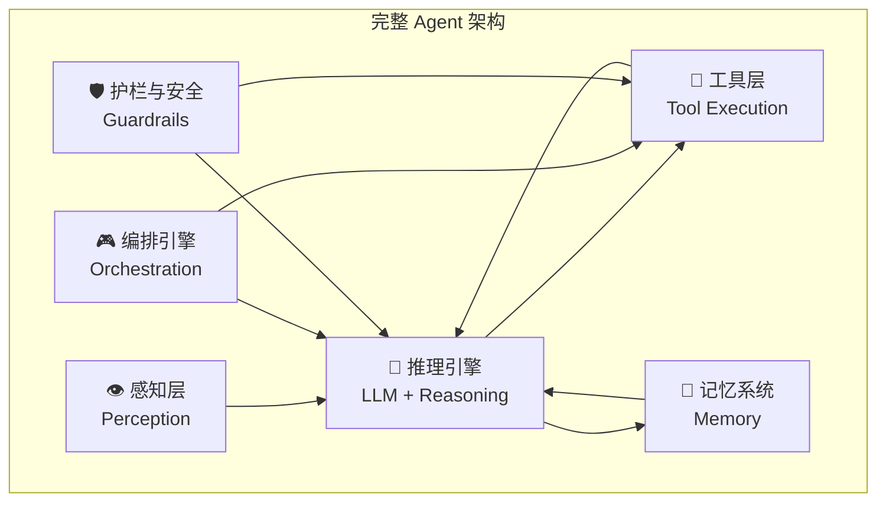
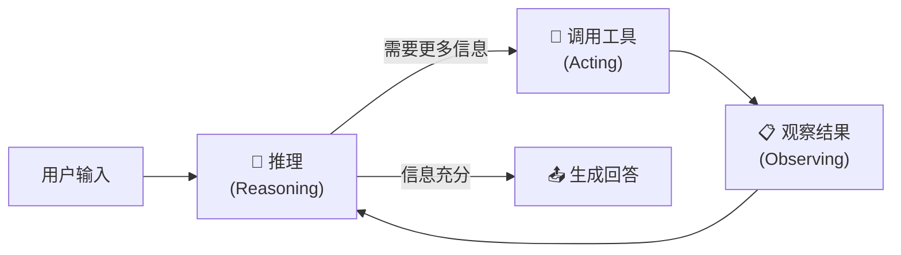
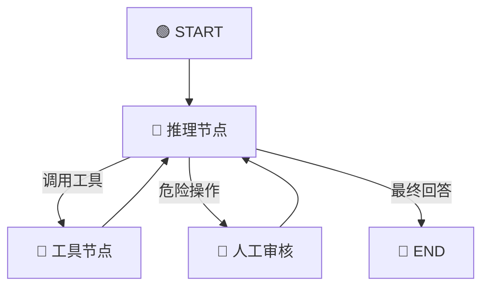

# YoloStudio Agent 化可行性评估（完整版）

> **评估日期**：2026-04-08
> **评估对象**：YoloStudio (C:\workspace\yolodo2.0) + 服务器 203.0.113.10
> **评估目标**：将 YoloStudio 改造为 LLM Agent 驱动的智能 YOLO 全流程工具
> **调研方式**：项目代码审查 + 服务器 SSH 实机探查 + 联网调研

---

## 1. Agent 是什么？—— 核心构成拆解

一个生产级 AI Agent 不是一个 "能聊天的 AI"，而是一个**由 LLM 驱动的自主决策系统**。它由以下六层组成：



### 1.1 各层详解 & 映射到 YoloStudio

| 层级 | 职责 | 在 YoloStudio Agent 中的具体表现 |
|------|------|-------------------------------|
| **👁️ 感知层** | 接收用户输入，理解意图 | 解析自然语言指令："帮我把 D:/data 按 8:1:1 分割然后训练 100 轮" |
| **🧠 推理引擎** | LLM 作为大脑，分解任务、选择工具 | Gemma4 分析用户需求 → 决定调用 `scan_dataset` → `split_dataset` → `train_model` |
| **🔧 工具层** | 执行具体操作的函数集合 | 封装 `DataHandler`、`TrainManager`、`PredictManager` 的方法为 Tool |
| **💾 记忆系统** | 短期会话 + 长期知识存储 | 短期：当前对话上下文 / 长期：历史训练结果、数据集信息 |
| **🎮 编排引擎** | 管理"推理→行动→观察"循环 | LangGraph 状态机，控制 Agent 的多步执行流程 |
| **🛡️ 护栏与安全** | 防止危险操作，人工审核 | 删除文件前确认、训练参数范围校验、GPU 资源检查 |

### 1.2 Agent 的运行循环（ReAct 模式）

Agent 不是"一次性回答"，而是一个**循环**：



**具体示例**：

```
用户: "帮我检查 D:/hemorrhage_data 的质量然后训练"

Agent 内部循环:
  [推理] 用户想检查数据质量然后训练，先扫描数据集
  [行动] 调用 scan_dataset("D:/hemorrhage_data")
  [观察] 结果: 1200 张图, 1180 个标签, 类别: hemorrhage/normal
  [推理] 数据集存在 20 张无标签图片，先做质量检查
  [行动] 调用 validate_dataset("D:/hemorrhage_data")
  [观察] 结果: 20 张图片缺少标签文件，5 张标签格式错误
  [推理] 需要告知用户问题，并询问是否自动修复后继续训练
  [回答] "数据集有 25 个问题...(详情)...需要我自动修复然后开始训练吗？"

用户: "修复然后用 yolov8n 训练 50 轮"

  [推理] 用户确认修复并训练
  [行动] 调用 fix_dataset_issues(...)
  [观察] 修复完成，剩余 1180 张有效数据
  [推理] 数据已就绪，启动训练
  [行动] 调用 start_training(model="yolov8n", epochs=50, ...)
  [观察] 训练已启动，PID=12345
  [回答] "已开始训练 yolov8n，50 轮，预计耗时约 2 小时..."
```

---

## 2. 推荐技术栈：MCP Server + LangChain + LangGraph + Ollama

### 2.1 核心理念：MCP 协议暴露工具，LangGraph 编排智能

经过联网调研，2026 年的最佳实践是**用 MCP 标准化工具暴露，用 LangChain/LangGraph 编排 Agent 智能**。两者不是互斥的，而是分属不同层级：

| 层级 | 技术 | 角色 | 类比 |
|------|------|------|-----|
| **协议层** | **MCP (Model Context Protocol)** | 工具怎么暴露和调用 | USB-C 接口标准 |
| **编排层** | **LangChain + LangGraph** | Agent 怎么思考和调度 | 厨房 + 菜谱 |
| **推理层** | **Ollama (Gemma4)** | LLM 大脑 | 厨师 |

### 2.2 完整技术栈

| 组件 | 版本/模型 | 职责 | 为什么选它 |
|------|---------|------|----------|
| **MCP Server** | `mcp` SDK | 工具暴露层 | 标准协议，写一次多处复用（Claude/Cursor/Antigravity 均可调用） |
| **langchain-mcp-adapters** | 桥接库 | MCP - LangChain | 自动将 MCP 工具转为 LangChain 原生工具 |
| **LangGraph** | `langgraph` | Agent 编排 | 状态机、循环控制、检查点、Human-in-the-Loop |
| **LangChain** | `langchain-ollama` | LLM 集成 | ChatOllama、Prompt 模板 |
| **Ollama** | 已安装 | LLM 推理引擎 | 本地部署，HTTP API (:11434) |
| **Gemma4:e4b** | 9.6GB，已下载 | Agent 大脑 | 原生 Function Calling + Thinking + 多模态 |

> [!IMPORTANT]
> **Gemma4（2026 年 4 月发布）原生支持 Function Calling：**
> - 原生 JSON 格式函数调用 + 多步规划 + "Thinking" 模式
> - 通过 Ollama + LangChain `bind_tools` 可直接使用
> - **现有的 Gemma4 完全可以做 Agent，不需要换模型。**

### 2.3 为什么用 MCP 而不是纯 LangChain @tool？

| 对比维度 | MCP Server | LangChain @tool |
|---------|------------|----------------|
| **可移植性** | 一套工具，Claude/Cursor/Antigravity/自建 Agent 都能用 | 只在 LangChain 生态内 |
| **部署解耦** | Server 跑在服务器，Client 在任何地方连 | 工具和 Agent 必须同进程 |
| **远程访问** | HTTP/SSE 传输，跨网络调用 | 需额外封装 API |
| **标准化** | 行业标准协议 | 框架私有格式 |
| **编排能力** | 无（只管连接） | 有状态机、记忆、循环 |
| **结合使用** | `langchain-mcp-adapters` 无缝桥接 | 桥接后用法完全一样 |

> [!TIP]
> **最佳方案 = MCP 暴露工具 + LangChain 桥接 + LangGraph 编排**，三者各司其职。

### 2.4 系统架构图

```
 客户端（Windows / 服务器 / 任意位置）
 ==========================================================

   用户交互层 (CLI / Web / Claude Desktop)
        |
   LangGraph 编排引擎 (Agent 状态机)
   [ 推理节点 ] -> [ 路由判断 ] -> [ MCP 调用 ] -> [ 结果观察 ]
        ^                                            |
        '-------------- 循环 <----------------------'
        |
   langchain-mcp-adapters (MCP -> LangChain 桥接)
        |
        | Streamable HTTP (通过 SSH Tunnel 转发)
 ==========================================================
 服务器 203.0.113.10（服务仅绑定 127.0.0.1）
        |
   YoloStudio MCP Server (:8080, streamable-http)
   +---------------------------------------------------+
   | Tools:                                             |
   |  scan_dataset       (直接调 DataHandler Mixin)      |
   |  split_dataset      (直接调 DataHandler Mixin)      |
   |  validate_dataset   (直接调 DataHandler Mixin)      |
   |  start_training     (Service Wrapper → subprocess)  |
   |  check_training_status (日志解析器)                  |
   |  stop_training      (Service Wrapper)               |
   |  predict_image      (直接调 ultralytics API)        |
   |  get_gpu_status     (nvidia-smi 调用)               |
   +---------------------------------------------------+
        |
   +---------------------------------------------------+
   | DataHandler (直接复用)   | Train/Predict Wrapper    |
   | core/data_handler/      | (新增 service 层,         |
   |  _scan.py               |  绕过 Qt QProcess/       |
   |  _split.py              |  QThread 封装)           |
   |  _validate.py           |  train_service.py        |
   |  _augment.py            |  predict_service.py      |
   +---------------------------------------------------+

   [Ollama :11434]          [YOLO (GPU 1)]
   [GPU 0: RTX 3060]        [GTX TITAN X]
   [Gemma4:e4b]             [训练 / 推理]
```

**关键优势**：
- **MCP Server 写一次，到处用** — Claude Desktop、Cursor、Antigravity 都能直接连接
- **客户端通过 SSH Tunnel 安全访问** — 服务不暴露到网络
- **DataHandler 直接复用**；Train/Predict 新增 Service Wrapper 绕过 Qt 依赖


---

## 3. 项目现状分析

### 3.1 架构概览

YoloStudio 是一个基于 PySide6/Qt 的桌面应用，功能分为三个核心模块：

| 模块 | 核心能力 | 关键 API | 可 Agent 化的操作 |
|------|---------|---------|-----------------|
| **数据准备** | 扫描/拆分/增强/转换/校验/视频抽帧/图像质检 | `DataHandler` | `scan`, `split`, `validate`, `augment`, `convert`, `extract_frames`, `image_check` |
| **模型训练** | Conda 检测/YOLO 训练启动与监控 | `TrainManager` | `detect_envs`, `start_training`, `stop_training` |
| **预测推理** | 图像/视频/摄像头/批量推理 | `PredictManager` | `load_model`, `start`, `stop`, `predict_batch` |

### 3.2 模块化程度评估

> [!WARNING]
> **`core/` 层并非完全与 Qt 解耦。** 经代码审查，以下文件直接依赖 `PySide6.QtCore`：
>
> | 文件 | Qt 依赖 | Agent 封装策略 |
> |------|--------|---------------|
> | `core/data_handler/_scan.py` | ❌ 无 Qt 依赖 | ✅ **可直接工具化** |
> | `core/data_handler/_models.py` | ❌ 纯 dataclass | ✅ **可直接使用** |
> | `core/data_handler/_worker.py` | ✅ `QThread, Signal` | 🟡 需绕过，直接调 Mixin |
> | `core/train_handler.py` | ✅ `QObject, QProcess, Signal` | 🔴 **需 wrapper 层** |
> | `core/predict_handler/_manager.py` | ✅ `QObject, QThread, Signal` | 🔴 **需 wrapper 层** |
> | `core/predict_handler/_worker.py` | ✅ `QObject, Signal, Slot` | 🔴 **需 wrapper 层** |
> | `core/output_manager.py` | ✅ `QObject, Signal` | 🟡 需 wrapper |
> | `utils/logger.py` | ✅ Qt 日志集成 | 🟡 需替代方案 |
>
> **结论**：DataHandler 业务层（Mixin 方法）可直接工具化；Train/Predict/Output 需要编写 Service Wrapper 来脱离 Qt 事件循环。

| 维度 | 评级 | 说明 |
|------|------|------|
| **DataHandler 可用性** | ⭐⭐⭐⭐⭐ | Mixin 纯函数，不依赖 Qt，可直接封装为 MCP Tool |
| **Train/Predict 可用性** | ⭐⭐⭐ | 绑定 QProcess/QThread，需编写 subprocess wrapper |
| **API 清晰度** | ⭐⭐⭐⭐⭐ | 接口设计清晰，参数/返回类型明确 |
| **配置管理** | ⭐⭐⭐⭐⭐ | 线程安全单例 AppConfig，JSON 持久化 |
| **错误处理** | ⭐⭐⭐⭐ | 全局异常钩子 + 分层错误处理 |

### 3.3 核心改造点

| 改造项 | 难度 | 说明 |
|-------|------|------|
| DataHandler Mixin → MCP Tool | 🟢 低 | 直接调用 `scan_dataset()` / `split_dataset()` 等纯函数 |
| TrainManager → 训练 Wrapper | 🟡 中 | 用 `subprocess.Popen` 替代 `QProcess`，需日志解析器提取 epoch/loss |
| PredictManager → 推理 Wrapper | 🟡 中 | 直接调 ultralytics Python API，绕过 Qt 线程封装 |
| 训练状态监控 | 🔴 较难 | 需开发 **YOLO 日志解析器**：从 stdout 提取 epoch/loss/ETA 为结构化数据 |
| OutputManager → 文件服务 | 🟢 低 | Tool 返回文件路径，Agent 可配合多模态查看 |

---

## 4. 服务器实机探查（2026-04-08）

### 4.1 硬件与软件概况

| 资源 | 规格 | 状态 |
|------|------|------|
| **CPU** | Intel Core i7-7700 @ 3.60GHz (8 线程) | ✅ 空闲 |
| **内存** | 62 GB（42 GB 空闲） | ✅ 充裕 |
| **GPU 0** | **NVIDIA GeForce RTX 3060** (12288 MiB) | ✅ 空闲 0% |
| **GPU 1** | **NVIDIA GeForce GTX TITAN X** (12288 MiB) | ✅ 空闲 0% |
| **总显存** | **24 GB 双卡** | ✅ |
| **CUDA / 驱动** | 12.2 / 535.230.02 | ✅ |
| **存储** | 916GB，259GB 可用 (71%) | ✅ 足够 |
| **OS** | Ubuntu 20.04.6 LTS | ✅ |

**已安装软件**:

| 组件 | 状态 | 详情 |
|------|------|------|
| **Ollama** | ✅ | `~/ollama/bin/ollama` |
| **Gemma4:26b** | ✅ | 17 GB（多模态，大模型） |
| **Gemma4:e4b** | ✅ | 9.6 GB（多模态，推荐 Agent 用） |
| **Conda** | ✅ | base + yolodo 环境 |
| **PyTorch** | ✅ | 2.0.1+cu117，双卡均可见 |
| **Docker** | ✅ | 已安装，无运行容器 |

### 4.2 GPU 双卡分配方案

双卡的核心价值：**LLM 和 YOLO 可以物理隔离，互不干扰**。

| GPU | 设备 | 专用任务 | 显存预算 | Ollama 实例 |
|-----|------|---------|---------|-------------|
| **GPU 0** | RTX 3060 (12GB) | **LLM Agent** | Gemma4:e4b ~10GB | `:11434` (默认) |
| **GPU 1** | TITAN X (12GB) | **YOLO 训练/推理** | 训练 ~6GB + 推理 ~2GB | 不使用 |

**GPU 隔离配置方法**：

```bash
# 方案 1: 启动 Ollama 时限制到 GPU 0
CUDA_VISIBLE_DEVICES=0 ~/ollama/bin/ollama serve &

# 方案 2: 如果 Ollama 注册为 systemd 服务
# sudo systemctl edit ollama.service
# [Service]
# Environment="CUDA_VISIBLE_DEVICES=0"

# YOLO 训练时指定 GPU 1
# yolo train model=yolov8n.pt data=data.yaml device=1
```

**并行能力**：

| | LLM 推理 (GPU 0) | YOLO 训练 (GPU 1) | YOLO 推理 (GPU 1) |
|------|:---:|:---:|:---:|
| **LLM 推理 (GPU 0)** | — | ✅ 并行 | ✅ 并行 |
| **YOLO 训练 (GPU 1)** | ✅ 并行 | — | ❌ 同卡 |
| **YOLO 推理 (GPU 1)** | ✅ 并行 | ❌ 同卡 | ✅ |

---

## 5. 完整 Agent 架构设计

### 5.1 MCP Server 实现（服务器端）

> 工具通过 MCP Server 暴露，遵循最佳实践：**强类型参数、单一职责、明确描述、Fail-fast 错误处理。**

```python
# yolostudio_mcp_server.py — 运行在服务器 203.0.113.10 上
# 传输层：使用官方推荐的 Streamable HTTP (FastMCP)
from mcp.server.fastmcp import FastMCP
from pathlib import Path

mcp = FastMCP("yolostudio")

# ============ 数据准备工具（直接调用 DataHandler Mixin）============

@mcp.tool()
async def scan_dataset(img_dir: str, label_dir: str = "") -> str:
    """扫描 YOLO 格式数据集，返回图片/标签数量和类别分布。
    在分割或训练前，应先调用此工具了解数据集概况。"""
    from core.data_handler import DataHandler
    handler = DataHandler()
    # 真实 API: scan_dataset() 方法来自 ScanMixin
    result = handler.scan_dataset(
        img_dir=Path(img_dir),
        label_dir=Path(label_dir) if label_dir else None,
    )
    # 真实字段: ScanResult dataclass (core/data_handler/_models.py)
    return (f"总图片: {result.total_images}, "
            f"已标注: {result.labeled_images}, "
            f"缺失标签: {len(result.missing_labels)}, "
            f"空标签: {result.empty_labels}, "
            f"类别: {result.classes}, "
            f"类别统计: {result.class_stats}")

@mcp.tool()
async def split_dataset(dataset_path: str, train_ratio: float = 0.8,
                        val_ratio: float = 0.1, test_ratio: float = 0.1) -> str:
    """按比例拆分数据集为 train/val/test。比例之和必须等于 1.0。"""
    ...

@mcp.tool()
async def validate_dataset(dataset_path: str) -> str:
    """校验数据集质量：缺失标签、空标注、坐标越界、类别不连续等。"""
    ...

# ============ 训练工具（需要 Service Wrapper）============
# 注意: TrainManager 依赖 QProcess，MCP Tool 需通过 subprocess 封装

@mcp.tool()
async def start_training(model: str = "yolov8n.pt", data_yaml: str = "",
                         epochs: int = 100, device: str = "1") -> str:
    """启动 YOLO 训练（device 默认 GPU 1，与 LLM 隔离）。
    训练为异步长时间操作，启动后用 check_training_status 查看进度。"""
    # 实现: 用 subprocess.Popen 替代 QProcess
    # 日志输出写入文件供 check_training_status 解析
    ...

@mcp.tool()
async def check_training_status() -> str:
    """查看训练状态：是否运行中、当前 epoch、loss 值。
    注意: 需要 YOLO 日志解析器从 stdout 提取结构化数据。"""
    # 实现: 读取训练日志文件，正则提取 epoch/loss/mAP
    # 现有 TrainManager 只有原始 stdout，需额外开发解析层
    ...

@mcp.tool()
async def stop_training() -> str:
    """停止当前训练。已完成的 epoch 结果会保留在 runs/ 目录中。"""
    ...

# ============ 推理工具（可直接用 ultralytics API）============

@mcp.tool()
async def predict_image(model_path: str, image_path: str,
                        conf: float = 0.5) -> str:
    """对单张图片推理，返回检测目标列表和标注图路径。"""
    # 实现: 直接用 ultralytics Python API，绕过 Qt 封装
    # from ultralytics import YOLO
    # model = YOLO(model_path)
    # results = model.predict(image_path, conf=conf, device="1")
    ...

@mcp.tool()
async def get_gpu_status() -> str:
    """查看双 GPU 状态：显存、温度、运行进程。训练前应先调用确认空闲。"""
    ...

# ============ 启动服务 ============
if __name__ == "__main__":
    # 官方推荐: Streamable HTTP（生产部署）
    mcp.run(transport="streamable-http", host="127.0.0.1", port=8080)
    # 注意: 绑定 127.0.0.1 而非 0.0.0.0，通过 SSH Tunnel 或反向代理暴露
    # 如需 SSE 兼容旧客户端: mcp.run(transport="sse")
```

### 5.2 Agent 客户端（可在任意位置运行）

> [!IMPORTANT]
> **前置条件**：先建立 SSH 隧道，再运行客户端。
> ```bash
> ssh -L 8080:127.0.0.1:8080 -L 11434:127.0.0.1:11434 agent@203.0.113.10
> ```

```python
# agent_client.py — 在 Windows 上运行，通过 SSH Tunnel 连接服务器
from langchain_mcp_adapters.client import MultiServerMCPClient
from langchain_ollama import ChatOllama
from langgraph.prebuilt import create_react_agent

async def main():
    # 1. 连接 MCP Server（通过 SSH Tunnel 转发到本地端口）
    client = MultiServerMCPClient({
        "yolostudio": {
            "transport": "streamable-http",
            "url": "http://127.0.0.1:8080/mcp",  # SSH Tunnel 本地端口
        }
    })
    tools = await client.get_tools()

    # 2. 连接 Ollama（同样通过 SSH Tunnel）
    llm = ChatOllama(model="gemma4:e4b",
                     base_url="http://127.0.0.1:11434")  # SSH Tunnel 本地端口

    # 3. 创建 ReAct Agent
    agent = create_react_agent(llm, tools)

    # 4. 对话
    result = await agent.ainvoke({
        "messages": [{"role": "user", "content": "扫描 /data/hemorrhage 数据集"}]
    })
```

### 5.3 LangGraph 状态图设计

```python
from typing import TypedDict, Annotated
from langgraph.graph import StateGraph, START, END
from langgraph.graph.message import add_messages
from langgraph.checkpoint.sqlite import SqliteSaver
from langgraph.prebuilt import ToolNode
from langgraph.types import interrupt

class AgentState(TypedDict):
    """Agent 的全局状态"""
    messages: Annotated[list, add_messages]  # 对话历史（自动追加）
    pending_action: str | None               # 待确认的高风险操作
    training_active: bool                    # 是否有训练任务在运行

# 构建图
graph = StateGraph(AgentState)

# 添加节点
graph.add_node("reasoning", reasoning_node)      # LLM 推理
graph.add_node("tools", ToolNode(all_tools))      # 工具执行
graph.add_node("human_review", human_review_node) # 人工审核

# 添加边（控制流）
graph.add_edge(START, "reasoning")
graph.add_conditional_edges("reasoning", route_next_step, {
    "tools": "tools",           # 需要调用工具
    "human_review": "human_review",  # 需要人工确认
    "end": END,                 # 给出最终回答
})
graph.add_edge("tools", "reasoning")        # 工具结果 → 继续推理
graph.add_edge("human_review", "reasoning") # 人工确认 → 继续推理

# 编译（使用 SQLite 持久化状态）
checkpointer = SqliteSaver.from_conn_string("agent_state.db")
agent = graph.compile(checkpointer=checkpointer)
```



### 5.4 Human-in-the-Loop 设计

Agent 不能无限制地自主操作。以下操作**必须经过用户确认**：

| 危险等级 | 操作类型 | Agent 行为 |
|---------|---------|-----------|
| 🔴 高危 | 删除文件/清空数据集 | **中断等待确认**，展示即将删除的内容 |
| 🟡 中危 | 启动训练（独占 GPU） | **提示确认**，展示训练参数摘要 |
| 🟡 中危 | 修改/覆盖标签文件 | **提示确认**，展示修改预览 |
| 🟢 安全 | 扫描/查看/统计 | 直接执行，无需确认 |
| 🟢 安全 | 推理/预测 | 直接执行，结果异常时提醒 |

**LangGraph 实现**：

```python
from langgraph.types import interrupt

def human_review_node(state: AgentState):
    """需要人工确认的节点"""
    action = state["pending_action"]

    # 中断图执行，等待用户输入
    user_decision = interrupt({
        "question": f"⚠️ 即将执行高风险操作: {action}",
        "options": ["确认执行", "取消"]
    })

    if user_decision == "确认执行":
        return {"messages": [AIMessage(content="用户已确认，继续执行...")]}
    else:
        return {"messages": [AIMessage(content="操作已取消。")]}
```

### 5.5 记忆系统设计

| 记忆类型 | 存储内容 | 实现方式 | 生命周期 |
|---------|---------|---------|---------|
| **工作记忆** | 当前对话消息链 | LangGraph State `messages` | 单次会话 |
| **短期记忆** | 最近 N 轮对话摘要 | SQLite (LangGraph Checkpoint) | 跨会话保持 |
| **长期记忆** | 数据集信息、训练历史、模型清单 | SQLite + JSON 文件 | 永久 |
| **语义记忆**（可选） | 用户偏好、常用参数模式 | ChromaDB 向量数据库 | 永久 |

> [!NOTE]
> **MVP 阶段建议**：只实现工作记忆 + 短期记忆（LangGraph 自带），长期/语义记忆在 V2 迭代时添加。

### 5.6 安全与网络设计

> [!CAUTION]
> **裸露 HTTP 端口是不可接受的生产部署方式。** MCP Server 和 Ollama 都不应直接暴露到网络。

#### 网络暴露策略

| 组件 | 默认端口 | 推荐策略 | 说明 |
|------|---------|---------|------|
| **MCP Server** | `:8080` | 绑定 `127.0.0.1` + SSH Tunnel | 不暴露到网络，客户端通过 SSH 端口转发访问 |
| **Ollama** | `:11434` | 绑定 `127.0.0.1`（默认） | 同上，通过 SSH Tunnel 访问 |

#### 推荐方案：SSH Tunnel

```bash
# 在 Windows 客户端上建立 SSH 隧道（一条命令转发两个端口）
ssh -L 8080:127.0.0.1:8080 -L 11434:127.0.0.1:11434 agent@203.0.113.10

# 然后 Agent 客户端连接本地端口即可
# MCP:    http://127.0.0.1:8080/mcp
# Ollama: http://127.0.0.1:11434
```

#### 其他方案（按需选择）

| 方案 | 适用场景 | 安全性 |
|------|---------|-------|
| **SSH Tunnel**（推荐） | 个人开发/单用户 | ⭐⭐⭐⭐⭐ 端到端加密 |
| **Nginx 反向代理 + BasicAuth** | 多用户/团队 | ⭐⭐⭐⭐ 需 HTTPS |
| **MCP HTTP Auth（协议层认证）** | 跨组织共享 | ⭐⭐⭐⭐ MCP 规范支持 |
| **仅局域网 + 防火墙** | 可信内网 | ⭐⭐⭐ 最低限度 |
| **裸露 0.0.0.0** | ❌ 不推荐 | ⭐ 任何人可调用 |

---

## 6. 实施路线图

### Phase 1: 基础设施（3 天）

- [ ] 在服务器上配置 Ollama GPU 隔离：`CUDA_VISIBLE_DEVICES=0`
- [ ] 安装服务器端依赖：`mcp` (FastMCP)
- [ ] 安装客户端依赖：`langchain-ollama`, `langchain-mcp-adapters`, `langgraph`
- [ ] 验证 Gemma4 Function Calling（`bind_tools` 快速测试）
- [ ] 设计并确认完整的 MCP Tool Schema

### Phase 2: MCP Server 开发（5 天）

- [ ] 搭建 MCP Server 框架（FastMCP + streamable-http）
- [ ] 编写 Train Service Wrapper（subprocess 替代 QProcess）
- [ ] 编写 Predict Service Wrapper（ultralytics API 替代 Qt 线程）
- [ ] 编写 YOLO 训练日志解析器（正则提取 epoch/loss/mAP）
- [ ] 封装 `data_handler` 工具集（scan/split/validate/augment/convert）
- [ ] 封装 `train_handler` 工具集（start/stop/status）
- [ ] 封装 `predict_handler` 工具集（predict/batch）
- [ ] 封装系统工具集（GPU 状态/文件操作）
- [ ] 实现 MCP Resources（数据集统计/训练日志等只读数据源）
- [ ] 每个 Tool 的独立测试 + MCP Inspector 验证

### Phase 3: Agent 编排（5 天）

- [ ] 用 `langchain-mcp-adapters` 桥接 MCP 工具到 LangGraph
- [ ] 实现 LangGraph 状态图（ReAct 循环）
- [ ] 实现 Human-in-the-Loop 审核节点
- [ ] System Prompt 编写与调优
- [ ] 实现 CLI 交互入口
- [ ] 端到端流程测试（客户端 -> MCP Server -> Core）

### Phase 4: 集成与优化（4 天）

- [ ] 完整场景测试（数据->训练->推理 全流程）
- [ ] 跨网络测试（Windows 客户端 -> 服务器 MCP + Ollama）
- [ ] 异常处理与恢复（网络断开、训练中断、GPU 故障等）
- [ ] 性能优化（MCP 连接池、推理延迟、Tool 超时处理）
- [ ] 文档与使用指南
- [ ] （可选）配置 Claude Desktop / Cursor 直接调用 MCP Server

**总预估工期：2.5 ~ 3 周**

---

## 7. 风险分析与结论

### 7.1 风险矩阵

| 风险 | 概率 | 影响 | 缓解措施 |
|------|------|------|---------|
| Gemma4 Function Calling 不稳定 | 中 | 高 | Pydantic 强类型校验 + 重试机制 + 简化 Tool 描述 |
| 训练长时间占用 GPU 1 | 高 | 中 | Training Tool 返回异步状态，Agent 轮询 check_status |
| LLM 推理延迟慢（TITAN X 偏老） | 低 | 中 | 已改用 RTX 3060 跑 LLM，3060 算力更强 |
| Agent 误操作删除/覆盖文件 | 低 | 高 | Human-in-the-Loop 强制拦截所有写操作 |
| Qt Signal 与同步 Tool 冲突 | 中 | 低 | Tool 层直接调用 core 层纯函数，绕过 Qt 信号 |
| 对话上下文超出 LLM 窗口 | 中 | 中 | LangGraph 自动管理 + 摘要压缩策略 |

### 7.2 综合评估

| 评估维度 | 评分 | 说明 |
|---------|------|------|
| **代码基础** | 🟢 可行 | core 层模块化优秀，可直接被 Tool 封装 |
| **服务器算力** | 🟢 可行 | 双卡 24GB 已确认，LLM 与 YOLO 物理隔离 |
| **LLM 能力** | 🟢 可行 | Gemma4 原生支持 Function Calling + Thinking |
| **技术栈成熟度** | 🟢 可行 | MCP + LangChain + LangGraph 是 2026 年主流方案 |
| **改造难度** | 🟢 可行 | 新增 MCP Server + Agent 编排层，不动核心代码 |
| **实用价值** | 🟢 高 | 自然语言驱动 YOLO 全流程，一套 MCP 多处复用 |

### 7.3 最终结论

> [!TIP]
> **🟢 项目完全可行。**
>
> 服务器双卡配置充裕，Gemma4 原生支持 Tool Calling，MCP + LangChain + LangGraph 技术栈成熟。
>
> **DataHandler 业务层可直接工具化**（纯函数，无 Qt 依赖）；**Train/Predict 模块需编写 Service Wrapper** 来脱离 Qt 事件循环（约占总工期 30%）。
>
> 预计 **2.5-3 周** 可完成 MVP。MCP Server 写一次，自建 Agent、Claude Desktop、Cursor 等均可直接调用。

---

## 8. 待确认事项

1. **交互方式选择**：
   - A) 命令行对话（CLI Chat）— 最简单，MVP 推荐
   - B) Web 聊天界面（Streamlit / Gradio）— 体验好，稍复杂
   - C) 保留 GUI + 内嵌 Agent 对话窗口 — 最完整但工作量大

2. **Agent 客户端运行位置**（MCP 架构下两者都很容易实现）：
   - A) 全部在服务器上（MCP Server + Agent Client 同机）— 最简单
   - B) MCP Server 在服务器，Agent Client 在 Windows — 体验更好，已原生支持

3. **优先 Agent 化的模块**：
   - 数据准备（功能最丰富，价值最大）
   - 训练管理（用户痛点最明显）
   - 全部一起（工期更长但体验完整）

4. **是否需要在 Claude Desktop / Cursor 中也能用？**
   - 如果需要，MCP Server 需配置为局域网可访问
